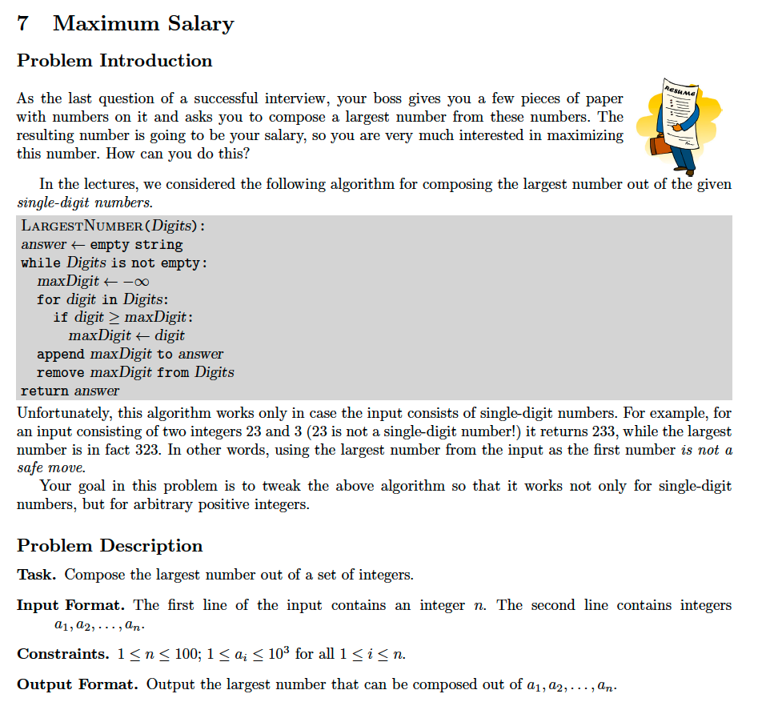

# 7. Maximum Salary
[https://en.wikipedia.org/wiki/Greedy_algorithm](https://en.wikipedia.org/wiki/Greedy_algorithm)

## Problem



## Solutions
* [C](#c)
* [C++](#cpp)
* [Java](#java)
* [Python3](#python3)

### C
```c
    #include <stdio.h>
    #include <stdlib.h>

    typedef int Type;
    typedef Type* HType;

    const int MAX_LEN = 10;

    int cmp( const void* lhs, const void* rhs ){
        Type first  = *( HType ) lhs,
             second = *( HType ) rhs;
        char a[ MAX_LEN ],
             b[ MAX_LEN ];
        sprintf( a, "%d", first );
        sprintf( b, "%d", second );
        int i=0;
        for(; a[ i ] && b[ i ]; ++i ){
            if( a[ i ] > b[ i ] ) return -1;
            if( a[ i ] < b[ i ] ) return  1;
        }
        return(( ! a[ i ] && ! b[ i ] ) || ( ! a[ i ] && b[ i ] && a[ i-1 ] > b[ i ] ))? -1 : 1;
    }

    void maxSalary( HType A, Type N ){
        qsort( A, N, sizeof( Type ), cmp );
        for( int i=0; i < N; ++i )
            printf( "%d", A[ i ] );
        printf( "\n" );
    }

    int main() {
        Type N = 0;
        scanf( "%d", &N );
        Type A[ N ];
        for( int i=0; i < N; scanf( "%d", &A[ i++ ] ));
        maxSalary( A, N );
        return 0;
    }
```

### CPP
```cpp
    #include <iostream>
    #include <sstream>
    #include <set>
    #include <string>
    #include <vector>
    #include <iterator>
    #include <algorithm>

    using namespace std;

    struct cmp {
        bool operator()( const string& lhs, const string& rhs ) const {
            int i{ 0 }, N = min( lhs.size(), rhs.size() );
            for(; i < N; ++i )
                if( lhs[ i ] < rhs[ i ] )
                    return false;
                else
                if( lhs[ i ] > rhs[ i ] )
                    return true;
            return(( lhs.size() == rhs.size() ) || ( lhs.size() < rhs.size() && lhs[ 0 ] > rhs[ i ] ))? true : false;
        }
    };

    template< typename Type >
    class Solution {
    public:
        using Collection = vector< Type >;
        string maxSalary( Collection A, ostringstream outStream=ostringstream() ){
            multiset< string, cmp > S;
            transform( A.begin(), A.end(), inserter( S, S.end() ), []( auto x ){ return to_string( x ); });
            copy( S.begin(), S.end(), ostream_iterator< string >( outStream ));
            return outStream.str();
        }
    };

    int main() {
        using Type = int;
        Solution< Type > solution;
        Solution< Type >::Collection A;
        auto N{ 0 }; cin >> N;
        for( int x{ 0 }; N--; cin >> x, A.push_back( x )); // copy_n( istream_iterator< int >( cin ), N, back_inserter( A ));
        auto ans = solution.maxSalary( A );
        cout << ans << endl;
        return 0;
    }
```

### Java
```java
    // TODO
```

### Python3
```python
    # TODO
```
