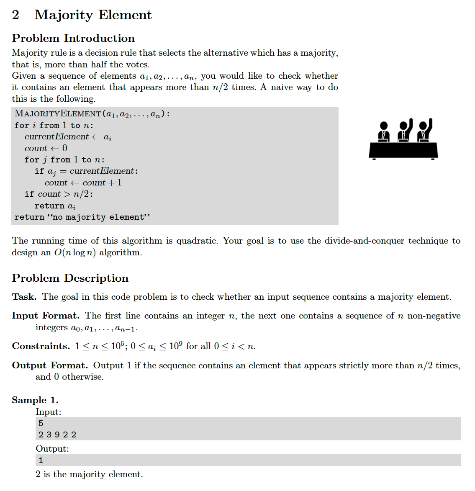
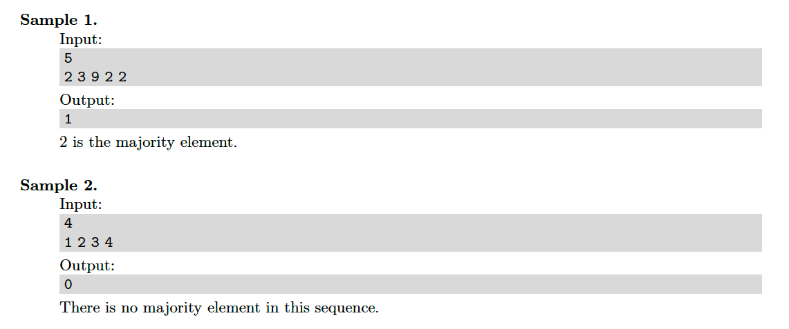
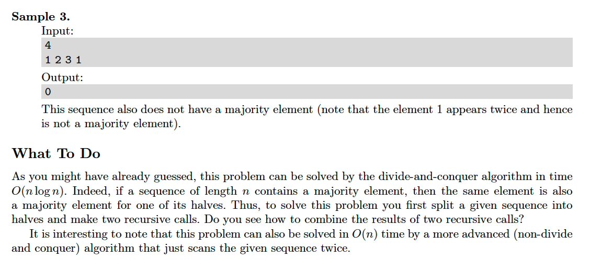

# 2. Majority Element
[https://en.wikipedia.org/wiki/Boyer–Moore_majority_vote_algorithm](https://en.wikipedia.org/wiki/Boyer–Moore_majority_vote_algorithm)

## Problem




## Solutions
* [C](#c)
* [C++](#cpp)
* [Java](#java)
* [Python3](#python3)

### C
```c
    #include <stdio.h>

    typedef int Type;
    typedef Type* HType;

    Type hasMajorityElement( HType A, Type N ){
        Type me = 0;
        for( size_t i=( 0 ), cnt=( 0 ); i < N; cnt=(( me == A[ i++ ] )? ( cnt + 1 ) : ( cnt - 1 )) )
            if( cnt == 0 )
                me = A[ i ];
        int cnt = 0,
            T = ( N / 2 ) + 1;
        for( size_t i=( 0 ); i < N; ++i )
            if( me == A[ i ] )
                ++cnt;
        return( T <= cnt );
    }

    int main() {
        Type N = 0;
        scanf( "%d", &N );
        Type A[ N ];
        for( size_t i=( 0 ); i < N; scanf( "%d", &A[ i++ ] ));
        Type ans = hasMajorityElement( A, N );
        printf( "%d", ans );
        return 0;
    }
```

### CPP
```cpp
    #include <iostream>
    #include <vector>
    #include <unordered_map>
    #include <iterator>
    #include <algorithm>

    using namespace std;

    using Type = int;
    using Collection = vector< Type >;

    class Solution {
    public:
        using Counter = unordered_map< Type, size_t >;
        bool hasMajorityElement( const Collection& A, Counter C={} ){
            for( auto x: A )
                ++C[ x ];
            auto N = A.size(),
                 T = ( N / 2 ) + 1;
            for( auto& pair: C )
                if( T <= pair.second )
                    return true;
            return false;
        }
    };

    int main() {
        Solution solution;
        auto N{ 0 }; cin >> N;
        Collection A;
        copy_n( istream_iterator< Type >( cin ), N, back_inserter( A ));
        auto ans = solution.hasMajorityElement( A );
        cout << ans << endl;
        return 0;
    }
```

### Java
```java
    import java.util.Scanner;

    public class Main {

        public static boolean hasMajorityElement( int[] A, int N ){
            int me = 0;
            for( int i=( 0 ), cnt=( 0 ); i < N; cnt=(( me == A[ i++ ] ) ? ( cnt + 1 ) : ( cnt - 1 )) )
                if( cnt == 0 )
                    me = A[ i ];
            int cnt = 0,
                T = ( N / 2 ) + 1;
            for( int i=( 0 ); i < N; ++i )
                if( me == A[ i ] )
                    ++cnt;
            return( T <= cnt );
        }

        public static void main( String[] args ){
            Scanner input = new Scanner( System.in );
            int N = input.nextInt();
            int[] A = new int[ N ];
            for( int i=( 0 ); i < N; A[ i++ ]=( input.nextInt() ));
            boolean ans = hasMajorityElement( A, N );
            System.out.println( ans? "1" : "0" );
        }
    }
```

### Python3
```python
    from typing import List

    class Solution:
        def hasMajorityElement( self, A: List[int], N: int ) -> bool:
            me = 0
            cnt = 0
            for x in A:
                if cnt == 0:
                    me = x
                cnt = cnt + 1 if me == x else cnt - 1
            cnt = 0
            T = ( N // 2 ) + 1
            for x in A:
                cnt = cnt + 1 if me == x else cnt
            return T <= cnt

    if __name__ == '__main__':
        solution = Solution()
        N = int( input() )
        A = list( map( int, input().split() ))
        ans = solution.hasMajorityElement( A, N )
        print( "1" if ans else "0" )
```
