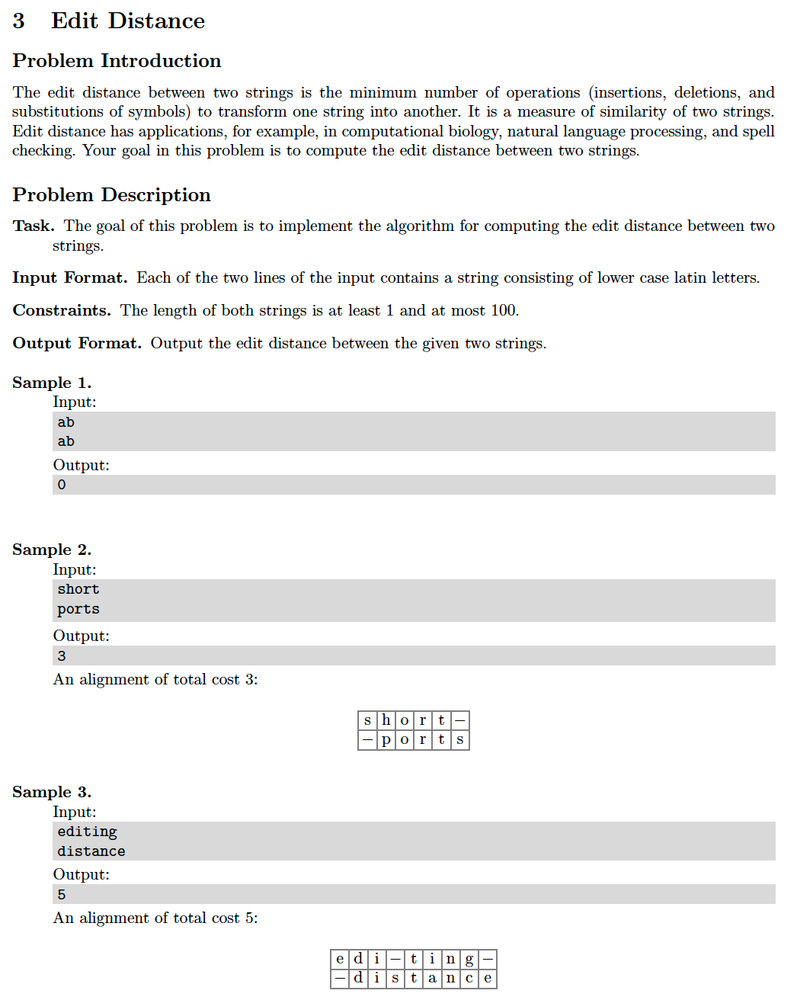

# 3. Editing Distance

## Problem


## Solutions
* [C++](#cpp)
* [Python3](#python3)

### CPP
```cpp
    #include <iostream>
    #include <sstream>
    #include <iterator>
    #include <algorithm>
    #include <vector>
    #include <queue>

    using namespace std;

    using VI = vector< int >;
    using VVI = vector< VI >;

    class Solution {
    public:
        int editDistance( const string& A, const string& B ){
            auto M = static_cast< int >( A.size() ),
                 N = static_cast< int >( B.size() );
            VVI dp( M+1, VI( N+1, 0 ) );
            for( auto i{ 1 }; i <= M; ++i ) dp[ i ][ 0 ] = i;
            for( auto j{ 1 }; j <= N; ++j ) dp[ 0 ][ j ] = j;
            for( auto i{ 1 }; i <= M; ++i )
                for( auto j{ 1 }; j <= N; ++j )
                    dp[ i ][ j ] = min({
                                dp[ i-1 ][ j-1 ] + (( A[ i-1 ] == B[ j-1 ] )? 0 : 1 ),
                                dp[ i-1 ][ j ] + 1,
                                dp[ i ][ j-1 ] + 1, });
            return dp[ M ][ N ];
        }
    };

    int main() {
        Solution solution;
        deque< string > A;
        copy_n( istream_iterator< string >( cin ), 2, back_inserter( A ));
        auto ans = solution.editDistance( A.front(), A.back() );
        cout << ans << endl;
        return 0;
    }
```

### Python3
```python
    class Solution:
        def editDistance( self, A: str, B: str ) -> int:
            M, N = len( A ), len( B )
            dp = [[ 0 ] * ( N+1 ) for _ in range( M+1 )]
            dp[ 0 ][ 0 ] = 0
            for i in range( 1, M+1 ):
                dp[ i ][ 0 ] = i
            for j in range( 1, N+1 ):
                dp[ 0 ][ j ] = j
            for i in range( 1, M+1 ):
                for j in range( 1, N+1 ):
                    cost = 0 if A[ i-1 ] == B[ j-1 ] else 1
                    dp[ i ][ j ] = min(
                        dp[ i-1 ][ j-1 ] + cost,
                        dp[ i-1 ][ j ] + 1,
                        dp[ i ][ j-1 ] + 1,
                    )
            return dp[ M ][ N ]

    if __name__ == '__main__':
        solution = Solution()
        A, B = input(), input()
        ans = solution.editDistance( A, B )
        print( ans )
```
