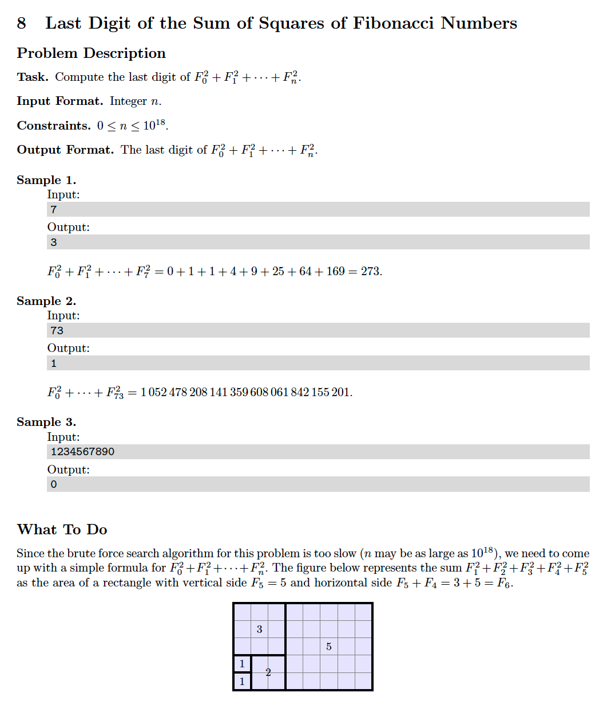

# 8 Last Digit of the Sum of Squares of Fibonacci Numbers Again
[https://en.wikipedia.org/wiki/Pisano_period](https://en.wikipedia.org/wiki/Pisano_period)

## Problem


## Solutions
* [C](#c)
* [C++](#cpp)
* [Java](#java)
* [Python3](#python3)

### C
```c
    #include <stdio.h>

    typedef unsigned long long Type;

    Type sum( Type* dp, Type N, Type M ){
        return( N > 0 )? ( dp[ N-1 ] * dp[ N ] ) % M : 0;
    }

    Type fibonacci( Type N, Type M ){
        ++N; // the sum of squared fibonacci numbers from 0 to N is equal to fib( N ) * fib( N+1 ), so iterate till fib( N+1 )
        Type dp[ (6*M)+2 ];
        dp[ 0 ] = 0;
        dp[ 1 ] = 1;
        dp[ 2 ] = 1;
        Type i = 3; // start looking for the pisano period from i=3 to ignore the first 0,1 sequence at dp[ 0 ] and dp[ 1 ]
        for(; i <= N && ! ( dp[ i-2 ] == 0 && dp[ i-1 ] == 1 ); ++i )
            dp[ i ] = ( dp[ i-2 ] + dp[ i-1 ] ) % M;
        Type P = i-2;                            // (P)isano period
        return( N <= i-1 )? sum( dp, N,     M )  // case 1) (P)isano period NOT reached, return the sum % M of N-th fibonacci number
                          : sum( dp, N % P, M ); // case 2) (P)isano period reached, return the sum % M of (N mod P)-th fibonacci number
    }

    int main(){
        Type N = 0,
             M = 10;
        scanf( "%llu", &N );
        Type ans = fibonacci( N, M );
        printf( "%llu\n", ans );
        return 0;
    }
```

### CPP
```cpp
    #include <iostream>
    #include <vector>
    #include <numeric>

    using namespace std;

    template< typename Type >
    class Solution {
    public:

        using Collection = vector< Type >;

        Type sum( Collection &dp, Type N, Type M ){
            return( N > 0 )? ( dp[ N-1 ] * dp[ N ] ) % M : 0;
        }

        Type fibonacci( Type N, Type M ){
            ++N; // the sum of squared fibonacci numbers from 0 to N is equal to fib( N ) * fib( N+1 ), so iterate till fib( N+1 )
            Collection dp( (6*M)+2, 0 );
            dp[ 0 ] = 0;
            dp[ 1 ] = 1;
            dp[ 2 ] = 1;
            Type i = 3; // start looking for the pisano period from i=3 to ignore the first 0,1 sequence at dp[ 0 ] and dp[ 1 ]
            for(; i <= N && ! ( dp[ i-2 ] == 0 && dp[ i-1 ] == 1 ); ++i )
                dp[ i ] = ( dp[ i-2 ] + dp[ i-1 ] ) % M;
            Type P = i-2;                            // (P)isano period
            return( N <= i-1 )? sum( dp, N,     M )  // case 1) (P)isano period NOT reached, return the sum % M of N-th fibonacci number
                              : sum( dp, N % P, M ); // case 2) (P)isano period reached, return the sum % M of (N mod P)-th fibonacci number
        }
    };

    int main(){
        using Type = unsigned long long;
        Solution< Type > solution;
        Type N{ 0 },
             M{ 10 };
        cin >> N;
        Type ans = solution.fibonacci( N, 10 );
        cout << ans << endl;
        return 0;
    }
```

### Java
```java
    import java.util.ArrayList;
    import java.util.Collections;
    import java.util.Scanner;

    public class Main {

        private static long sum( ArrayList< Long > dp, int N, int M ){
            return( N > 0 )? ( dp.get( N-1 ) * dp.get( N ) ) % M : 0;
        }

        private static long fibonacci( long N, int M ){
            ++N; // the sum of squared fibonacci numbers from 0 to N is equal to fib( N ) * fib( N+1 ), so iterate till fib( N+1 )
            ArrayList< Long > dp = new ArrayList<>( Collections.nCopies( (6*M)+2, Long.valueOf( 0 ) ));
            dp.set( 0, Long.valueOf( 0 ));
            dp.set( 1, Long.valueOf( 1 ));
            dp.set( 2, Long.valueOf( 1 ));
            int i = 3; // start looking for the pisano period from i=3 to ignore the first 0,1 sequence at dp[ 0 ] and dp[ 1 ]
            for(; i <= N && ! ( dp.get( i-2 ) == 0 && dp.get( i-1 ) == 1 ); ++i )
                dp.set( i, ( dp.get( i-2 ) + dp.get( i-1 ) ) % M );
            int P = i-2;                                         // (P)isano period
            return( N <= i-1 )? sum( dp, ( int ) N, M )          // case 1) (P)isano period NOT reached, return the N-th fibonacci number
                              : sum( dp, ( int ) ( N % P ), M ); // case 2) (P)isano period reached, return (N mod P)-th fibonacci number
        }

        public static void main( String[] args ){
            Scanner input = new Scanner( System.in );
            long N = input.nextLong();
            int  M = 10;
            long ans = fibonacci( N, M );
            System.out.println( ans );
        }
    }
```

### Python3
```python
    def sum( dp, N, M ):
        return ( dp[ N-1 ] * dp[ N ] ) % M if N > 0 else 0

    def fibonacci( N, M ):
        N += 1 # the sum of squared fibonacci numbers from 0 to N is equal to fib( N ) * fib( N+1 ), so iterate till fib( N+1 )
        dp = ( (6*M)+2 ) * [ 0 ]
        dp[ 0 ] = 0
        dp[ 1 ] = 1
        dp[ 2 ] = 1
        i = 3 # start looking for the pisano period from i=3 to ignore the first 0,1 sequence at dp[ 0 ] and dp[ 1 ]
        while i <= N and not ( dp[ i-2 ] == 0 and dp[ i-1 ] == 1 ):
            dp[ i ] = ( dp[ i-2 ] + dp[ i-1 ] ) % M
            i += 1
        P = i-2 # (P)isano period
        # case 1) (P)isano period NOT reached, return the N-th fibonacci number
        # case 2) (P)isano period reached, return (N mod P)-th fibonacci number
        ans = sum( dp, N, M ) if N <= i-1 else sum( dp, N % P, M )
        return ans

    if __name__ == '__main__':
        N = int( input() )
        M = 10
        ans = fibonacci( N, M )
        print( ans )
```
