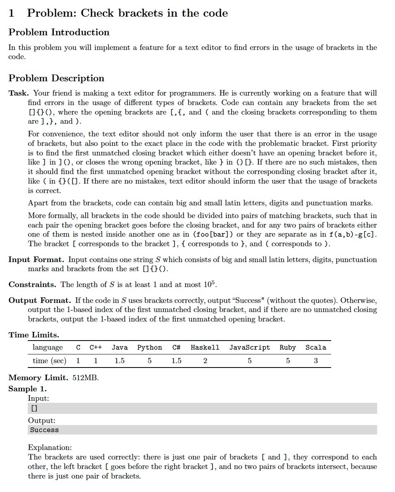
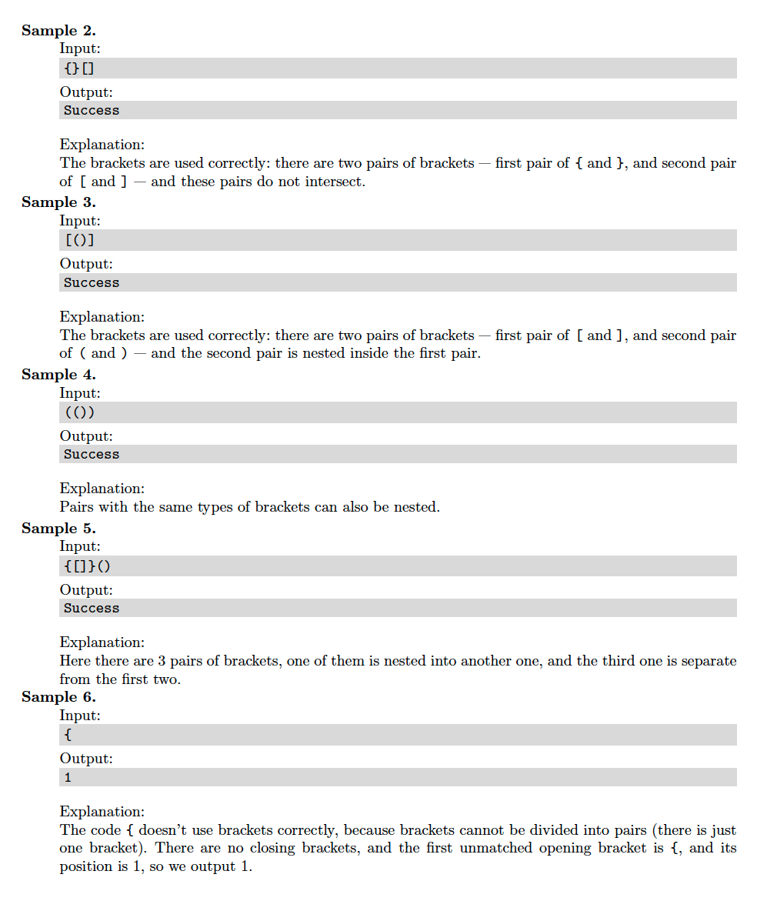
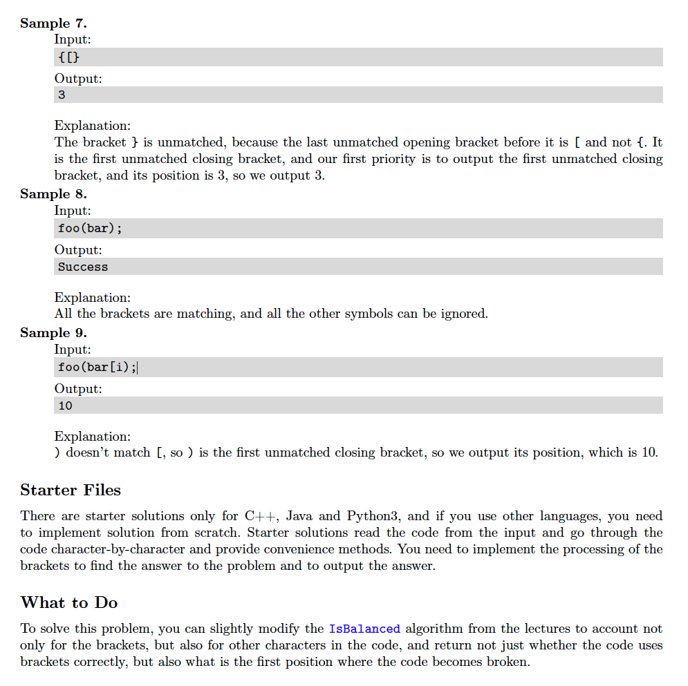

# 1. Bracket Match
[https://en.wikipedia.org/wiki/Brace_matching](https://en.wikipedia.org/wiki/Brace_matching)

## Problem




## Solutions
* [C++](#cpp)
* [Python3](#python3)

### CPP
```cpp
    #include <iostream>
    #include <vector>
    #include <string>

    using namespace std;

    class Solution {
    public:
        using Stack = vector< pair< char,int > >;
        int match( const string& A, Stack stack={}, string open="[{(", string close="]})" ){
            auto i{ 0 };
            for( auto c: A ){
                ++i; // 1-based indexing
                auto open_index = open.find( c ),
                     close_index = close.find( c );
                if( open_index == string::npos && close_index == string::npos )
                    continue;
                if( open_index != string::npos ){
                    stack.push_back({ close[ open_index ], i });
                } else {
                    if( stack.empty() )
                        return i;
                    auto target = stack.back().first;
                    auto match_index = close.find( target );
                    if( c != close[ match_index ] )
                        return i;
                    stack.pop_back();
                }
            }
            return( stack.empty() )? 0 : stack[ 0 ].second;
        }
    };

    int main() {
        string input;
        getline( cin, input );
        Solution solution;
        auto ans = solution.match( input );
        if( ans == 0 )
            cout << "Success" << endl;
        else
            cout << ans << endl;
        return 0;
    }
```

### Python3
```python
    from typing import List, Tuple

    Pair = Tuple[ str,int ]
    Stack = List[ Pair ]

    class Solution:
        def match( self, A: str, stack: Stack=[], open: str="[{(", close: str="]})" ) -> int:
            i = 0
            for c in A:
                i += 1 # 1-based indexing
                open_index = open.find( c )
                close_index = close.find( c )
                if open_index == -1 and close_index == -1:
                    continue
                if open_index != -1:
                    stack.append(( close[ open_index ], i ))
                else:
                    if not stack:
                        return i
                    target, _ = stack[ -1 ]
                    match_index = close.find( target )
                    if c != close[ match_index ]:
                        return i
                    stack.pop()
            return 0 if not stack else stack[ 0 ][ 1 ]

    if __name__ == '__main__':
        solution = Solution()
        ans = solution.match( input() )
        print( "Success" ) if ans == 0 else print( ans )
```
