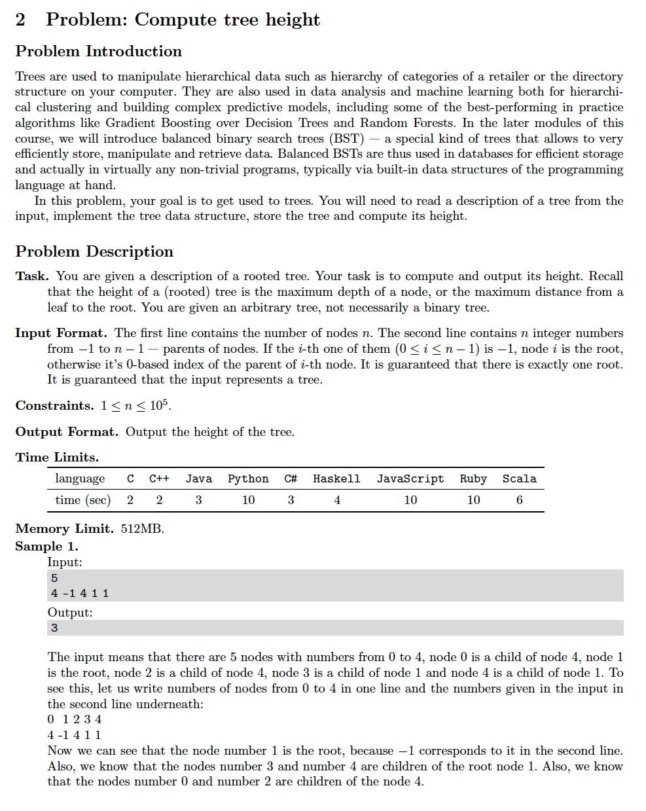
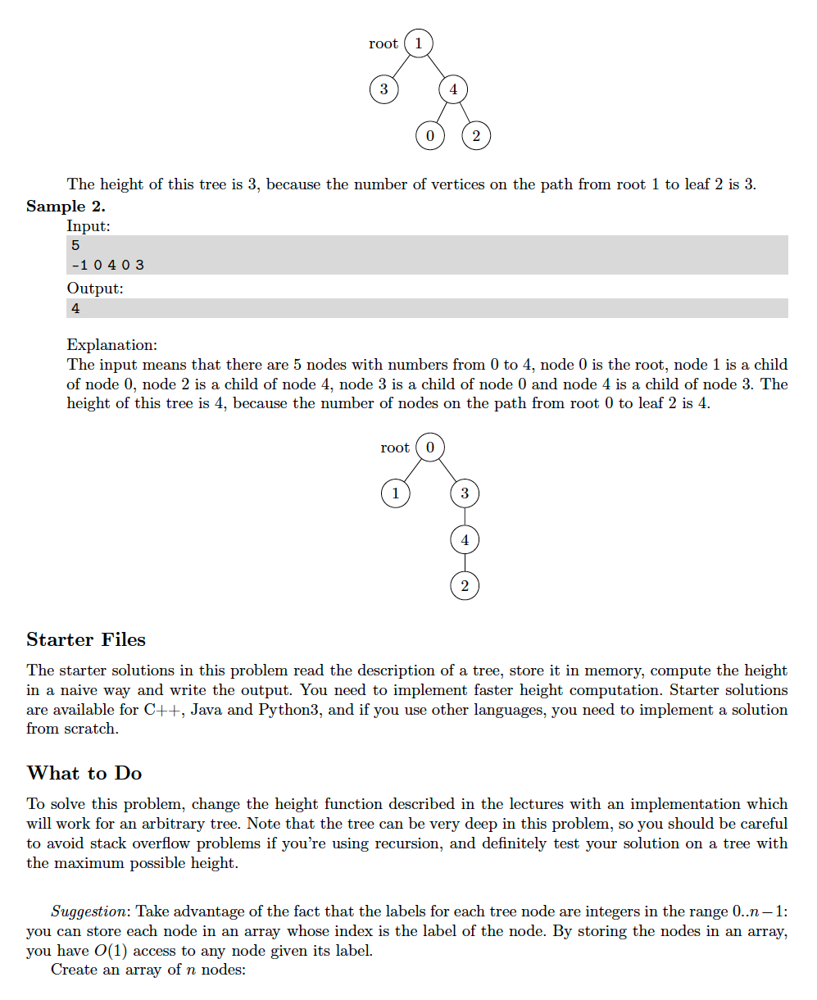
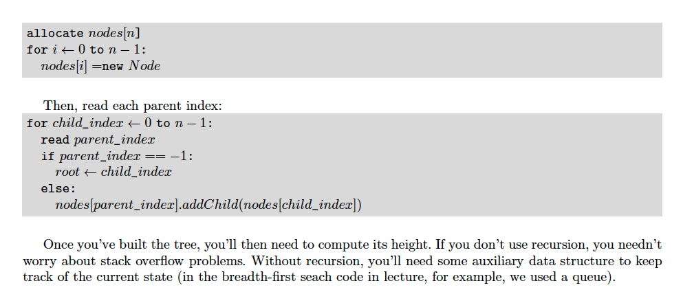

# 2. Tree Height
[https://en.wikipedia.org/wiki/Tree_(data_structure)](https://en.wikipedia.org/wiki/Tree_(data_structure))

## Problem




## Solutions
* [C++](#cpp)
* [Python3](#python3)

### CPP
```cpp
    #include <iostream>
    #include <vector>
    #include <algorithm>
    #include <memory>

    using namespace std;

    struct TreeNode;
    using HTreeNode = shared_ptr< TreeNode >;
    using Collection = vector< HTreeNode >;
    struct TreeNode {
        int val;
        Collection children;
        TreeNode( int val ) : val{ val } {}
    };

    class Solution {
    public:
        int height( HTreeNode root ){
            return go( root );
        }
    private:
        int go( HTreeNode root, int D=1 ){
            if( ! root )
                return 0;
            auto maxD = D;
            for( auto child: root->children )
                maxD = max( maxD, go( child, D + 1 ) );
            return maxD;
        }
    };

    int main() {
        auto N{ 0 }; cin >> N;
        Collection A;
        generate_n( back_inserter( A ), N, [i=0]() mutable { return make_shared< TreeNode >( i++ ); });
        HTreeNode root;
        for( auto parent{ 0 }, child{ 0 }; child < N && cin >> parent; ++child )
            if( 0 <= parent )
                A[ parent ]->children.push_back( A[ child ] );
            else
                root = A[ child ];
        Solution solution;
        auto ans = solution.height( root );
        cout << ans << endl;
        return 0;
    }
```

### Python3
```python
    import queue

    class TreeNode:
        def __init__( self, val: int ):
            self.val = int( val )
            self.children = []

    # RecursionError: maximum recursion depth exceeded
    # class Solution:
    #     def height( self, root: TreeNode ) -> int:
    #         return self.go( root )
    #     def go( self, root: TreeNode, D: int=1 ) -> int:
    #         if not root:
    #             return 0
    #         maxD = D
    #         for child in root.children:
    #             maxD = max( maxD, self.go( child, D + 1 ) )
    #         return maxD
        
    class Solution:
        def height( self, root: TreeNode, D: int=0 ) -> int:
            if not root:
                return 0
            cur = queue.Queue()
            cur.put( root )
            while not cur.empty():
                D += 1
                next = queue.Queue()
                while not cur.empty():
                    front = cur.get()
                    for child in front.children:
                        next.put( child )
                cur = next
            return D

if __name__ == '__main__':
    N = int( input() )
    A = list( map( TreeNode, range( N ) ) )
    for child, parent in enumerate( list( map( int, input().split() ) ) ):
        if 0 <= parent:
            A[ parent ].children.append( A[ child ] )
        else:
            root = A[ child ]
    solution = Solution()
    ans = solution.height( root )
    print( ans )
```
