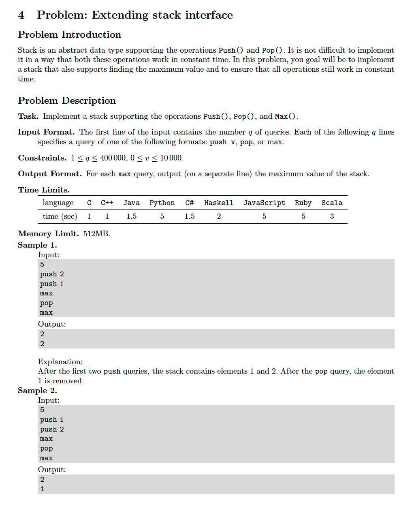
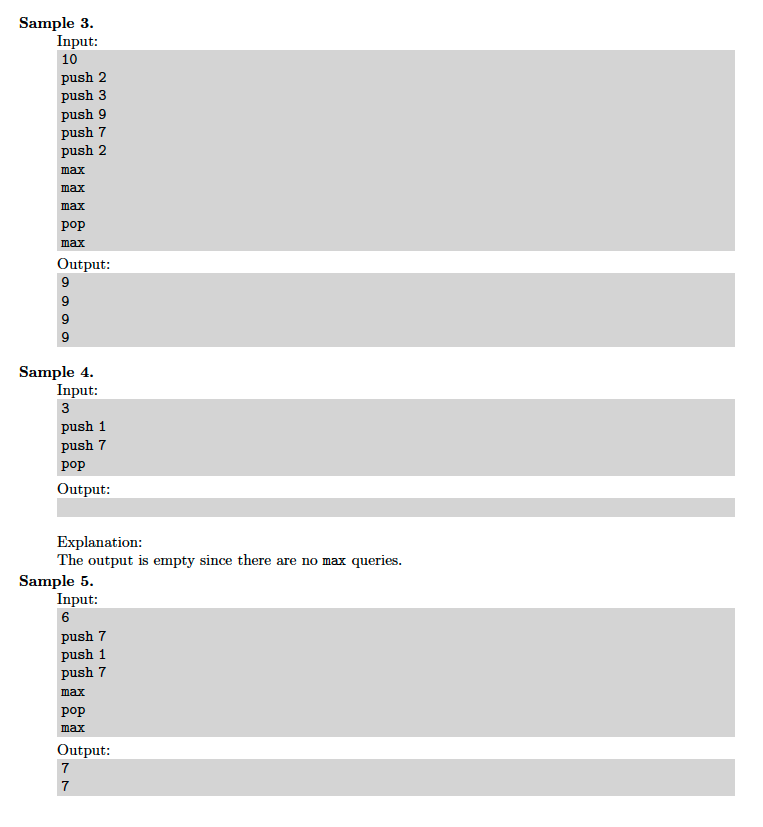

# 4. Max Stack
[https://en.wikipedia.org/wiki/Stack](https://en.wikipedia.org/wiki/Stack)

## Problem



## Solutions
* [C++](#cpp)
* [Python3](#python3)

### CPP
```cpp
    #include <iostream>
    #include <sstream>
    #include <vector>
    #include <string>

    using namespace std;

    template< typename Type >
    class Stack {
    public:
        void push( Type val ){
            stack_.push_back( val );
            if( max_.empty() || max_.back() <= val )
                max_.push_back( val );
        }
        int pop(){
            auto result = stack_.back();
            stack_.pop_back();
            if( result == max_.back() )
                max_.pop_back();
            return result;
        }
        int max() const {
            return max_.back();
        }
    private:
        vector< Type > stack_, max_;
    };

    int main() {
        using Type = int;
        auto N{ 0 }; cin >> N;
        Stack< Type > stack;
        for( string line, cmd; getline( cin, line ); ){
            istringstream parser{ line };
            parser >> cmd;
            if( cmd.find( "push" ) != string::npos )
                for( Type val{ 0 }; parser >> val; stack.push( val ));
            else
            if( cmd.find( "pop" ) != string::npos )
                stack.pop();
            else
            if( cmd.find( "max" ) != string::npos )
                cout << stack.max() << endl;
        }
        return 0;
    }
```

### Python3
```python
    class Stack:
        def __init__( self ):
            self.stack_ = []
            self.max_ = []
        def push( self, val: int ) -> None:
            self.stack_.append( val )
            if len( self.max_ ) == 0 or self.max_[ -1 ] <= val:
                self.max_.append( val )
        def pop( self ) -> None:
            result = self.stack_[ -1 ]
            self.stack_.pop()
            if result == self.max_[ -1 ]:
                self.max_.pop()
        def max( self ) -> int:
            return self.max_[ -1 ]

    if __name__ == '__main__':
        stack = Stack()
        N = int( input() )
        while 0 < N:
            line = input()
            if 0 <= line.find( "push" ):
                cmd, val = line.split()
                val = int( val )
                stack.push( val )
            elif 0 <= line.find( "pop" ):
                stack.pop()
            elif 0 <= line.find( "max" ):
                print( stack.max() )
            N -= 1
```
