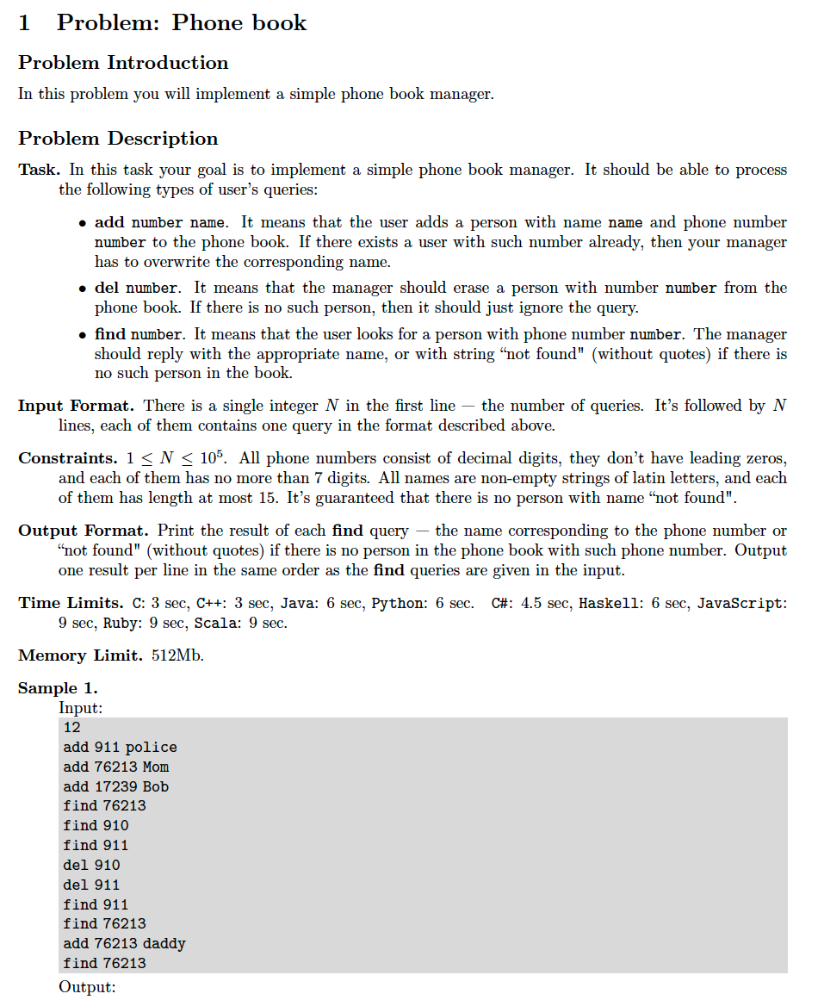
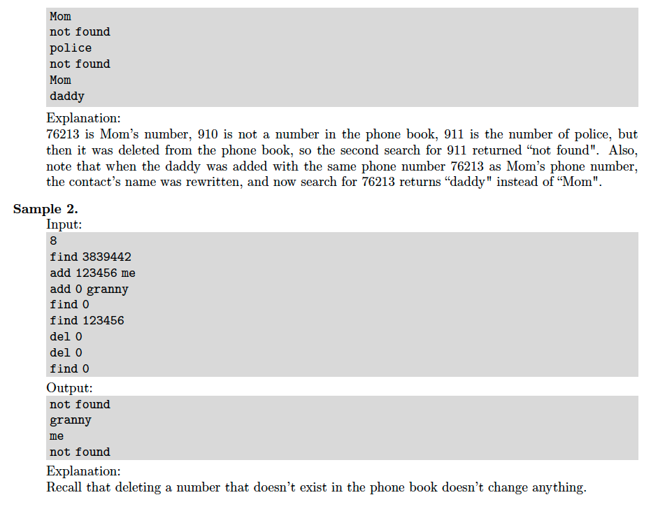

# 1. Phone Book
[https://en.wikipedia.org/wiki/Hash_table](https://en.wikipedia.org/wiki/Hash_table)

## Problem



## Solutions
* [C++](#cpp)

### CPP
```cpp
    #include <iostream>
    #include <sstream>
    #include <string>
    #include <vector>
    #include <unordered_map>
    #include <algorithm>
    #include <iterator>
    
    using namespace std;
    
    class Solution {
    public:
        void add( int num, const string& name ){
            map_[ num ] = name;
        }
        void del( int num ){
            map_.erase( num );
        }
        string find( int num ){
            auto it = map_.find( num );
            return( it != map_.end() )? it->second : "not found";
        }
    private:
        using Map = unordered_map< int, string >;
        Map map_;
    };
    
    int main() {
        Solution solution;
        vector< string > ans;
        auto N{ 0 }, num{ 0 };
        string line;
        getline( cin, line ); {
            istringstream parser{ line };
            parser >> N;
        }
        for( string cmd, name; N--; ){
            getline( cin, line );
            istringstream parser{ line };
            parser >> cmd;
            if( cmd == "add" ){
                parser >> num >> name;
                solution.add( num, name );
            }
            if( cmd == "del" ){
                parser >> num;
                solution.del( num );
            }
            if( cmd == "find" ){
                parser >> num;
                name = solution.find( num );
                ans.emplace_back( name );
            }
        }
        copy( ans.begin(), ans.end(), ostream_iterator< string >( cout, "\n" ) );
        return 0;
    }
```
