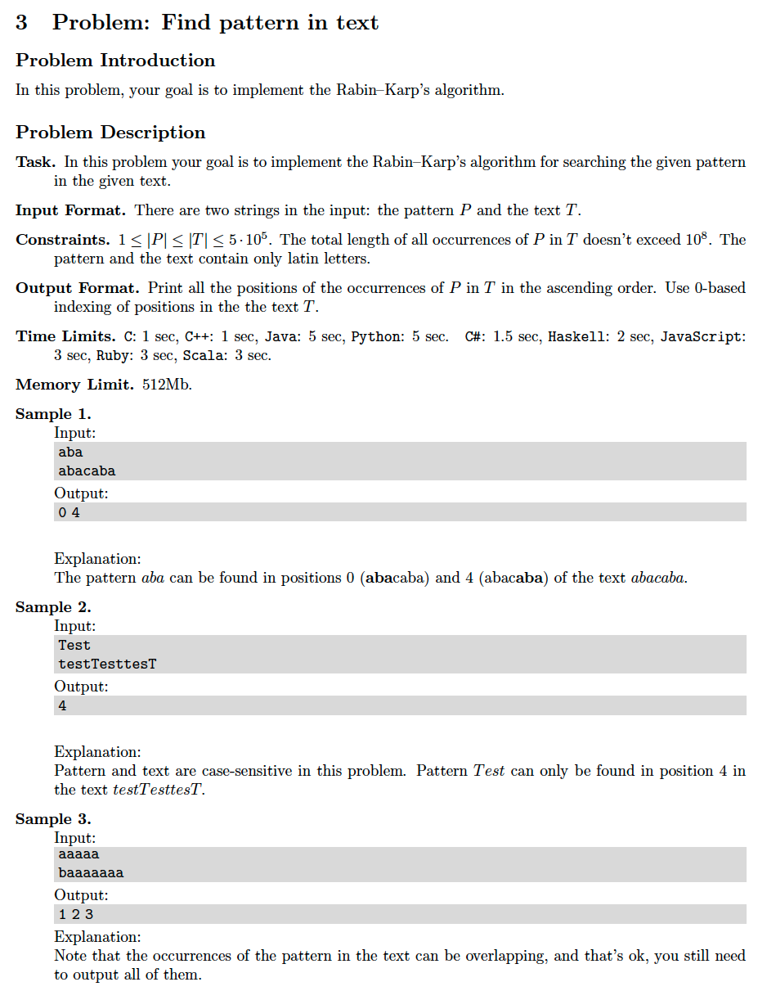

# 3. Find Pattern in Text
* [https://en.wikipedia.org/wiki/Rabin–Karp_algorithm](https://en.wikipedia.org/wiki/Rabin–Karp_algorithm)
* [https://en.wikipedia.org/wiki/Hash_table](https://en.wikipedia.org/wiki/Hash_table)

## Problem


## Solutions
* [C++](#cpp)

### CPP
```cpp
    #include <iostream>
    #include <unordered_map>
    #include <vector>
    #include <algorithm>
    #include <iterator>
    
    using namespace std;
    
    class Solution {
    public:
        using VI = vector< int >;
        VI find( const string& needle, const string& haystack, VI ans={} ){
            auto M = static_cast< int >( needle.size() ),
                 N = static_cast< int >( haystack.size() );
            auto T = hash( needle, 0, M ); // (T)arget
            auto H = preHash( haystack, M );
            for( auto i{ 0 }; i + M <= N; ++i )
                if( H[ i ] == T && needle == haystack.substr( i, M ) )
                    ans.push_back( i );
            return ans;
        }
    private:
        int hash( const string& S, int i, int M, int res=0 ){
            for( auto j{ i+M }; i < j; ++i )
                res += S[ i ];
            return res;
        }
        VI preHash( const string& S, int M ){
            auto N = S.size();
            VI H( N+1 - M );
            auto i = N - M;
            for( H[ i ] = hash( S, i, M ); 0 < i; --i )
                H[ i-1 ] = H[ i ] + S[ i-1 ] - S[ i-1 + M ];
            return H;
        }
    };
    
    int main() {
        string needle, haystack;
        cin >> needle >> haystack;
        auto ans = Solution().find( needle, haystack );
        copy( ans.begin(), ans.end(), ostream_iterator< int >( cout, " " ) );
        return 0;
    }
```
