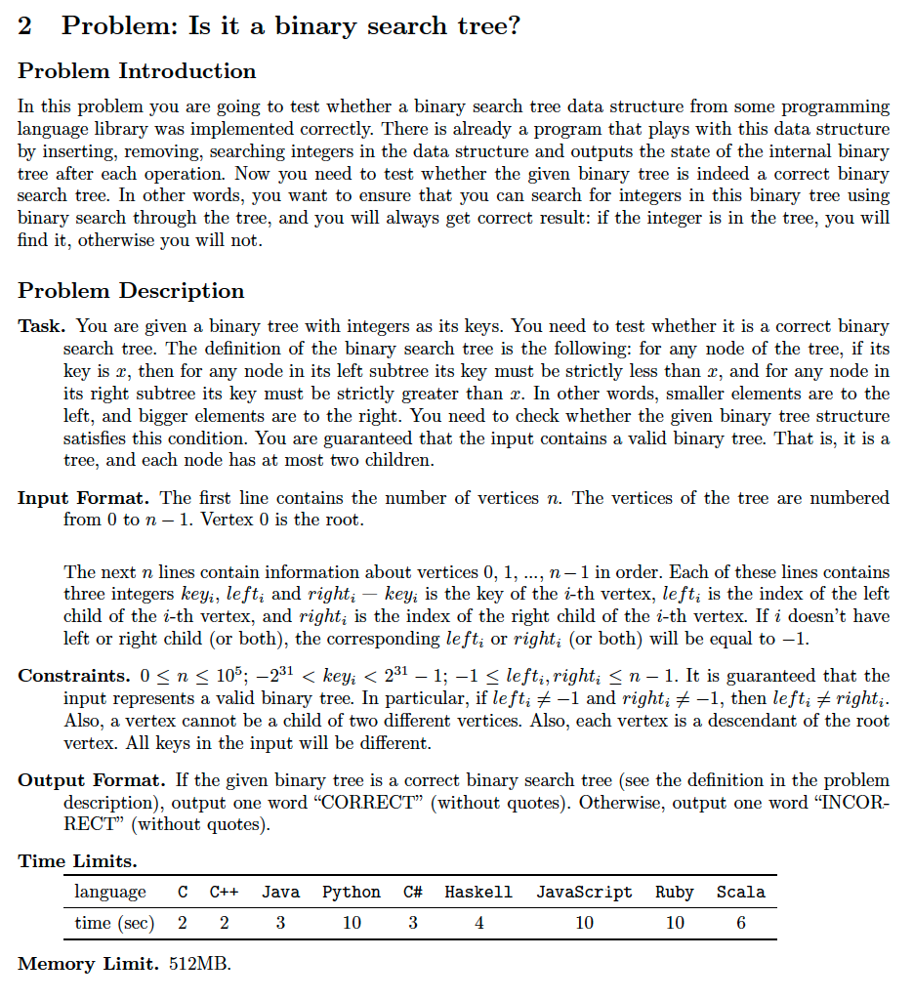
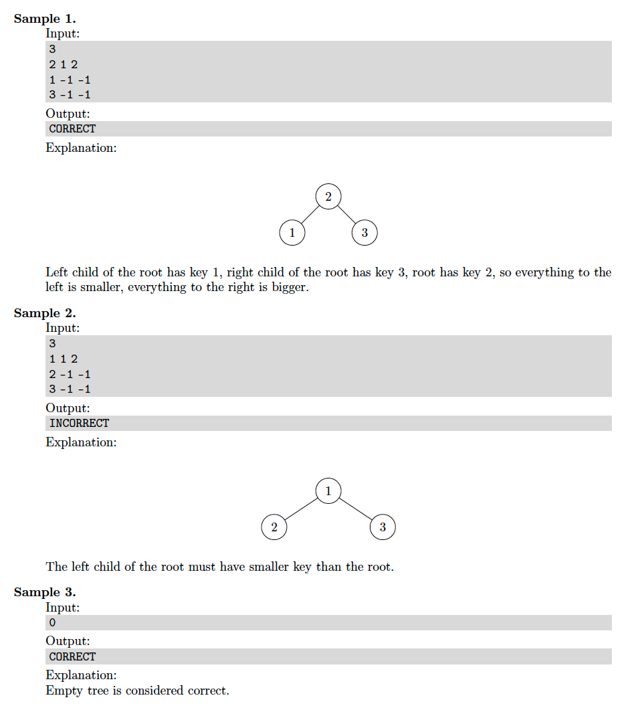
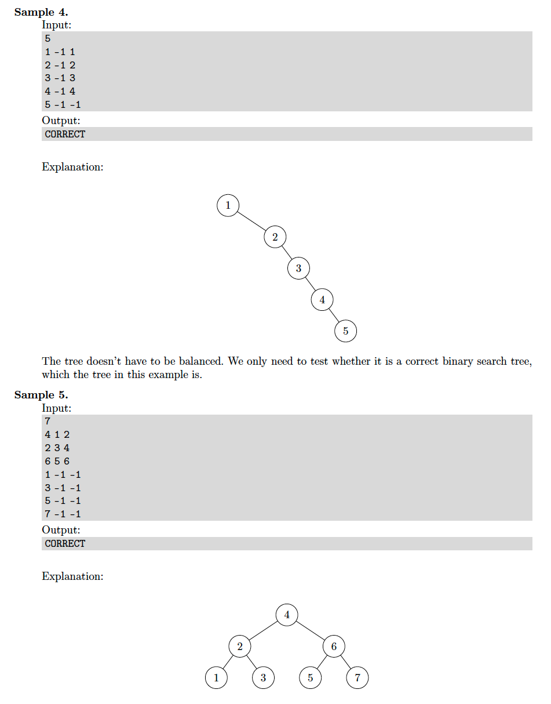
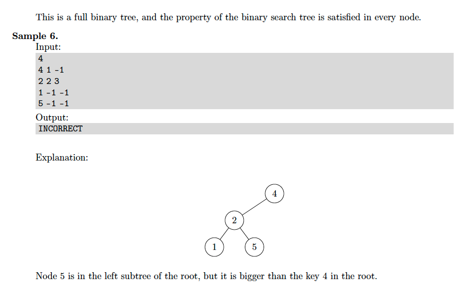

# 2. Is Binary Search Tree (unique values)
* [https://en.wikipedia.org/wiki/Binary_search_tree](https://en.wikipedia.org/wiki/Binary_search_tree)

## Problem





## Solutions
* [C++](#cpp)

### CPP
```cpp

```
