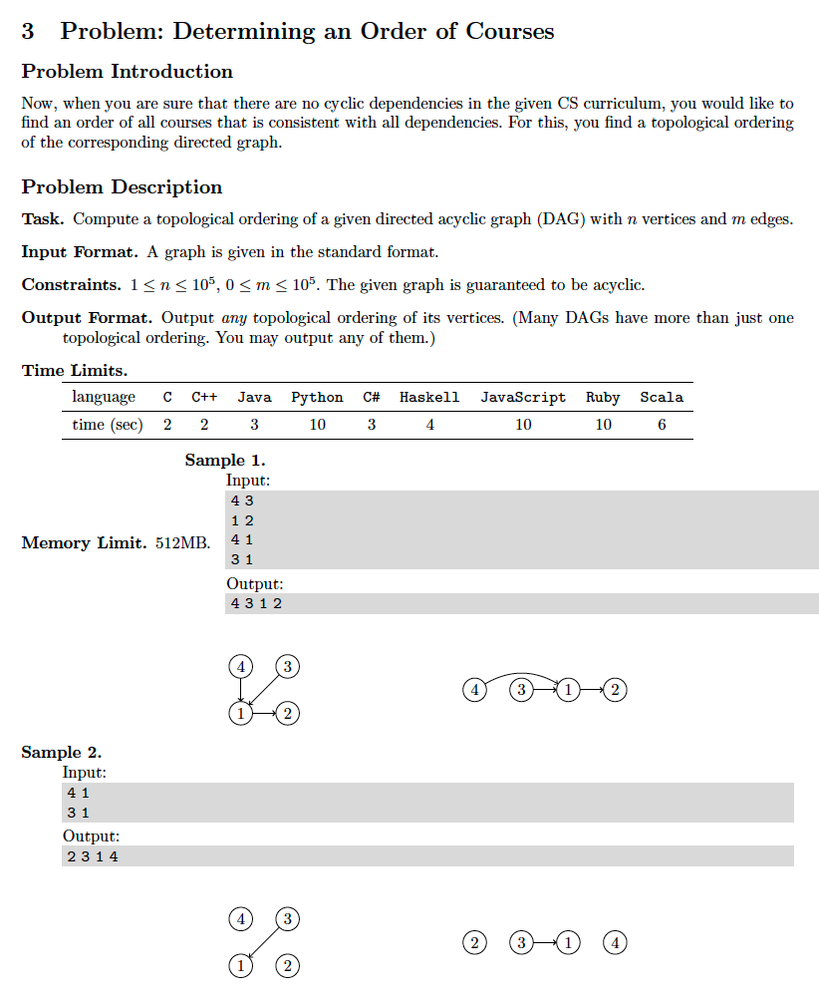
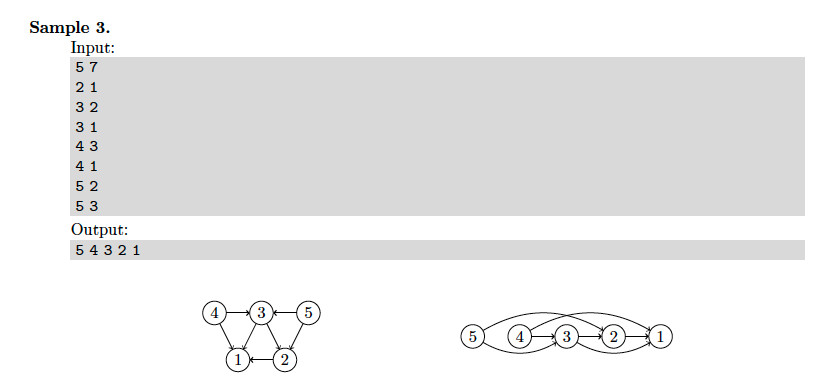

# 3. Topological Sort
* [https://en.wikipedia.org/wiki/Topological_sorting](https://en.wikipedia.org/wiki/Topological_sorting)

## Problem



## Solutions
* [C++](#cpp)

### CPP
```cpp
    #include <iostream>
    #include <sstream>
    #include <unordered_map>
    #include <unordered_set>
    #include <vector>
    #include <queue>
    #include <numeric>
    #include <algorithm>
    #include <iterator>
    
    using namespace std;
    using Vertex = int;
    using Graph = unordered_map< Vertex, unordered_set< Vertex > >;
    using Seen = unordered_set< Vertex >;
    using InDegree = vector< Vertex >;
    using Queue = queue< Vertex >;
    using Sorted = vector< Vertex >;
    
    int main() {
        auto N{ 0 }, M{ 0 }; cin >> N >> M;
        Queue q;
        Graph G;
        InDegree D( N+1 ); // +1 for 1-based index BFS pruning
        for( Vertex u{ 0 }, v{ 0 }; M-- && cin >> u >> v; ++D[ v ] )
            G[ u ].insert( v );
        for( auto i{ 1 }; i <= N; ++i )
            if( D[ i ] == 0 )
                q.push( i );
        Sorted S;
        for( Vertex u{ 0 }, v{ 0 }; ! q.empty(); ){
            u = q.front(), q.pop();
            S.push_back( u );
            for( auto v: G[ u ] )
                if( --D[ v ] == 0 )
                    q.push( v );
        }
        copy( S.begin(), S.end(), ostream_iterator< Vertex >( cout, " " ) );
        return 0;
    }
```
