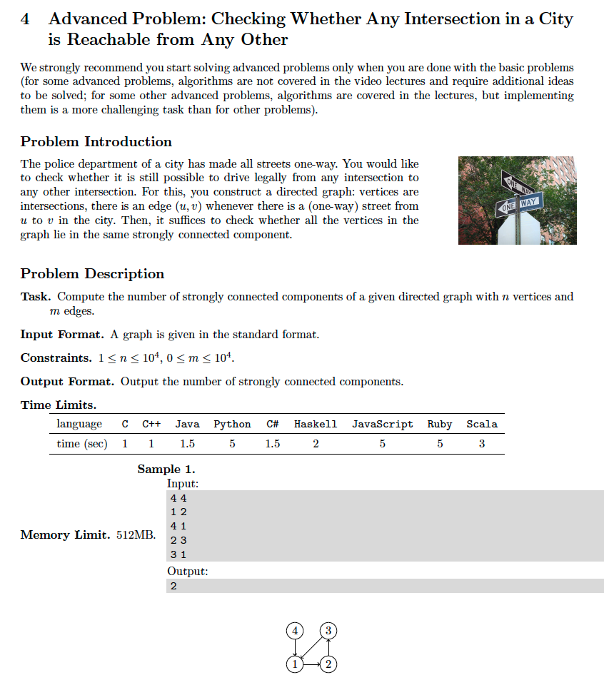
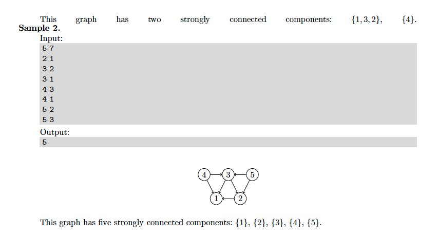

# 4. Strongly Connected Components
* [https://en.wikipedia.org/wiki/Strongly_connected_component](https://en.wikipedia.org/wiki/Strongly_connected_component)

## Problem



## Solutions
* [C++](#cpp)

### CPP
```cpp
    #include <iostream>
    #include <unordered_map>
    #include <unordered_set>
    #include <set>
    #include <vector>
    #include <queue>
    #include <sstream>
    #include <fstream>
    
    using namespace std;
    using Vertex = size_t;
    using AdjacencyList = unordered_set< Vertex >;
    using Graph = unordered_map< Vertex, AdjacencyList >;
    using Seen = unordered_set< Vertex >;
    using ConnectedComponents = vector< vector< Vertex > >;
    using Sorted = vector< Vertex >;
    using Stack = vector< Vertex >;
    using Path = vector< Vertex >;
    using InDegree = vector< Vertex >;
    using Queue = queue< Vertex >;
    
    class Solution {
    public:
        ConnectedComponents getSCC( Graph& G, ConnectedComponents CC={}, Stack S={}, Seen seen={} ){
            auto L = topo_sort( reverse( G ) );
            for( auto vertex: L ){
                if( seen.insert( vertex ).second )
                    S.push_back( vertex );
                Path P;
                while( ! S.empty() ){
                    auto u = S.back(); S.pop_back();
                    P.push_back( u );
                    for( auto v: G[ u ] )
                        if( seen.insert( v ).second )
                            S.push_back( v );
                }
                if( ! P.empty() )
                    CC.emplace_back( P );
            }
            return CC;
        }
    private:
        Graph reverse( Graph& G ){
            Graph R( G );        // (R)eversed (G)raph: keep G's vertex keys ( pair.first ),
            for( auto& pair: R ) // but clear G's adjacency lists ( pair.second )
                pair.second={};
            for( auto& pair: G ){
                auto u{ pair.first };
                for( auto v: G[ u ] )   // u -> v
                    R[ v ].insert( u ); // v -> u
            }
            return R;
        }
        Sorted topo_sort( Graph&& G, Queue q={}, Sorted S={} ){
            auto N = G.size();
            InDegree D( N+1 );
            for( auto i{ 1 }; i <= N; ++i )
                if( D[ i ] == 0 )
                    q.push( i );
            for( Vertex u{ 0 }, v{ 0 }; ! q.empty(); ){
                u = q.front(), q.pop();
                S.push_back( u );
                for( auto v: G[ u ] )
                    if( --D[ v ] == 0 )
                        q.push( v );
            }
            return S;
        }
    };
    
    int main() {
        Solution s;
        Graph G;
        auto N{ 0 }, M{ 0 }; cin >> N >> M;
        for( Vertex u{ 0 }, v{ 0 }; M-- && cin >> u >> v; G[ u ].insert( v ) );
        auto CC = s.getSCC( G );
        cout << CC.size() << endl;
        return 0;
    }
```
