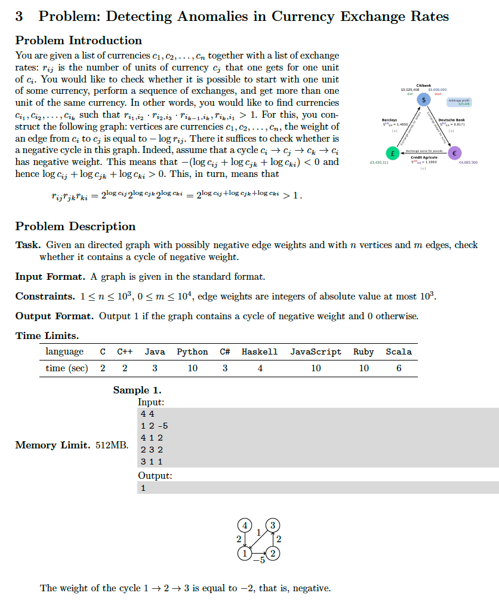

# 2. Bellman-Ford (negative cycle detection)
* [https://en.wikipedia.org/wiki/Bellman%E2%80%93Ford_algorithm](https://en.wikipedia.org/wiki/Bellman%E2%80%93Ford_algorithm)

## Problem


## Solutions
* [C++](#cpp)

### CPP
```cpp
    #include <iostream>
    #include <unordered_map>
    #include <unordered_set>
    #include <vector>

    using namespace std;
    using Vertex = int; using Weight = int;
    using Distance = vector< Weight >;
    struct Edge { Vertex u{ 0 }, v{ 0 }; Weight w{ 0 }; };
    using Edges = vector< Edge >;
    constexpr int INF = int( 1e4+1 );

    int main() {
        auto N{ 0 }, M{ 0 }; cin >> N >> M;
        Edges E; for( auto[ u,v,w ]=Edge{ 0,0,0 }; M-- && cin >> u >> v >> w; E.push_back({ u,v,w }) );
        Distance D( N+1, INF ); // +1 for 1-based indexing
        D[ 1 ] = 0; // assume 1 is the start vertex
        while( N-- )
            for( auto[ u,v,w ]: E )
                if( D[ v ] > D[ u ] + w )
                    D[ v ] = D[ u ] + w;
        bool hasCycle{ false };
        for( auto[ u,v,w ]: E )
            if( D[ v ] > D[ u ] + w )
                hasCycle = true;
        cout << hasCycle << endl;
        return 0;
    }
```