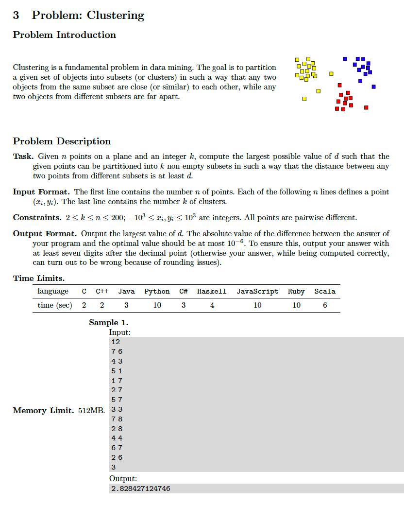
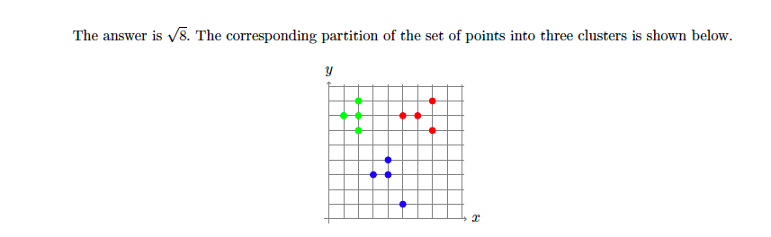

# 3. K-Clustering
* [https://en.wikipedia.org/wiki/K-means_clustering](https://en.wikipedia.org/wiki/K-means_clustering)

## Problem



## Solutions
* [C++](#cpp)

### CPP
```cpp
    #include <iostream>
    #include <sstream>
    #include <vector>
    #include <set>
    #include <unordered_set>
    #include <unordered_map>
    #include <cmath>
    #include <numeric>
    #include <iomanip>

    constexpr int INF = int( 1e3+1 );
    struct Vertex {
        int x{ 0 }, y{ 0 };
        Vertex() = default;
        Vertex( int x_, int y_ ) : x{ x_ }, y{ y_ } {}
        bool operator==( const Vertex& rhs ) const {
            return x == rhs.x && y == rhs.y;
        }
        size_t hash() const {
            return INF * x + y;
        }
    };
    struct Hash {
        size_t operator()( const Vertex& v ) const {
            return v.hash();
        }
    };
    struct Edge {
        Vertex u{ 0,0 }, v{ 0,0 };
        Edge( const Vertex& u_, const Vertex& v_ ) : u{ u_ }, v{ v_ } {}
        double length() const {
            auto X = abs( u.x - v.x ),
                 Y = abs( u.y - v.y );
            return sqrt( X*X + Y*Y );
        }
        bool operator<( const Edge& rhs ) const {
            return length() < rhs.length();
        }
    };
    using namespace std;
    using Vertices = unordered_set< Vertex, Hash >;
    using Edges = multiset< Edge >;
    using Parent = unordered_map< Vertex, Vertex, Hash >;

    Parent P;
    Vertex Find( const Vertex& x ){
        if( P[ x ] == x )
            return P[ x ];
        return P[ x ] = Find( P[ x ] );
    }
    bool Union( Vertex u, Vertex v ){
        u = Find( u );
        v = Find( v );
        if( u == v )
            return false;
        P[ u ] = v; // arbitrary choice
        return true;
    }

    int main() {
        auto N{ 0 }; cin >> N;
        auto M{ N };
        Vertices V;
        for( auto[ x,y ]=Vertex{ 0,0 }; N-- && cin >> x >> y; ){
            Vertex v{ x,y };
            P[ v ] = v;
            V.insert( v );
        }
        Edges E;
        for( auto& u: V )
            for( auto& v: V )
                if( u == v )
                    continue;
                else
                    E.insert({ u,v });
        auto K{ 0 }; cin >> K;
        for( auto& edge: E ){
            auto u = edge.u,
                 v = edge.v;
            if( Union( u,v ) && M-- <= K ){
                cout << setprecision( 13 ) << edge.length() << endl;
                break;
            }
        }
        return 0;
    }
```