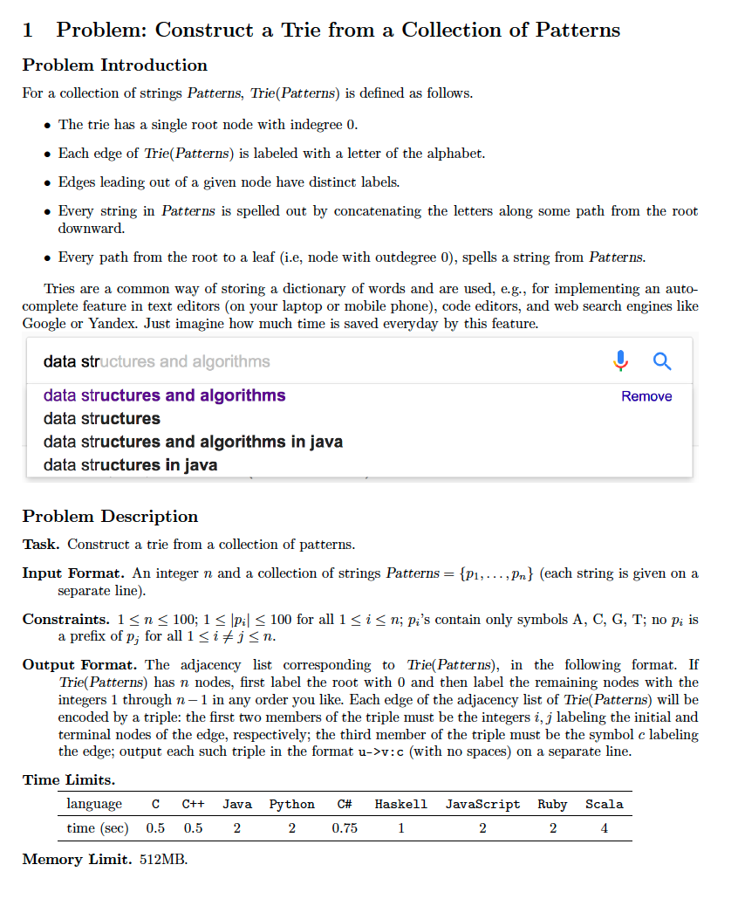
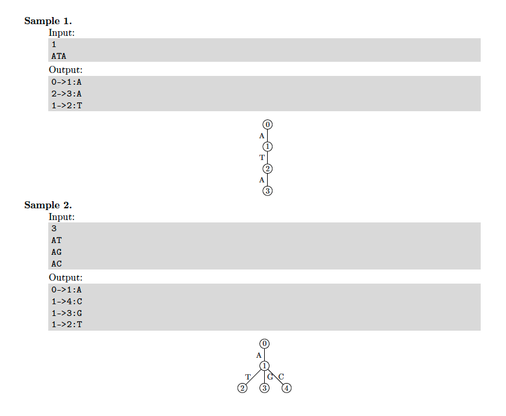
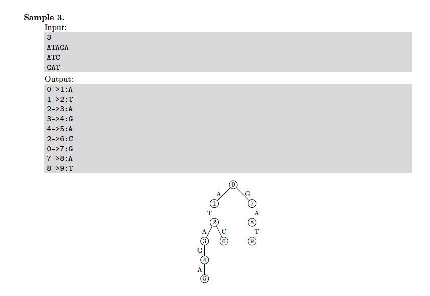

# 1. Trie
* [https://en.wikipedia.org/wiki/Trie](https://en.wikipedia.org/wiki/Trie)

## Problem




## Solutions
* [C++](#cpp)

### CPP
```cpp
    #include <iostream>
    #include <sstream>
    #include <unordered_map>
    #include <memory>
    #include <queue>
    
    using namespace std;
    
    class Trie {
    public:
        Trie() : N{ 0 }, root{ next() } {}
        void add( const string& s ){
            auto cur{ root };
            for( auto c: s ){
                auto it = cur->children.find( c );
                if( it != cur->children.end() ){
                    cur = it->second;
                } else {
                    auto node = next();
                    cur->children[ c ] = node;
                    cur = node;
                }
            }
        }
        string to_string() const {
            ostringstream os;
            queue< HNode > q{{ root }};
            for( HNode cur; ! q.empty(); ){
                cur = q.front(), q.pop();
                for( auto child: cur->children ){
                    auto c = child.first;
                    auto next = child.second;
                    os << cur->id << "->" << next->id << ":" << c << endl;
                    q.push( next );
                }
            }
            return os.str();
        }
    private:
        mutable int N;
        struct Node;
        using HNode = shared_ptr< Node >;
        HNode root;
        struct Node {
            explicit Node( int id_ ) : id{ id_ } {}
            const int id{ 0 };
            using Children = unordered_map< char, HNode >;
            Children children;
        };
        HNode next() const {
            return make_shared< Node >( N++ );
        }
    };
    ostream& operator<<( ostream& os, const Trie& trie ){
        os << trie.to_string();
        return os;
    }
    
    int main() {
        auto N{ 0 }; cin >> N;
        Trie T;
        for( string s; N-- && cin >> s; T.add( s ) );
        cout << T;
        return 0;
    }
```