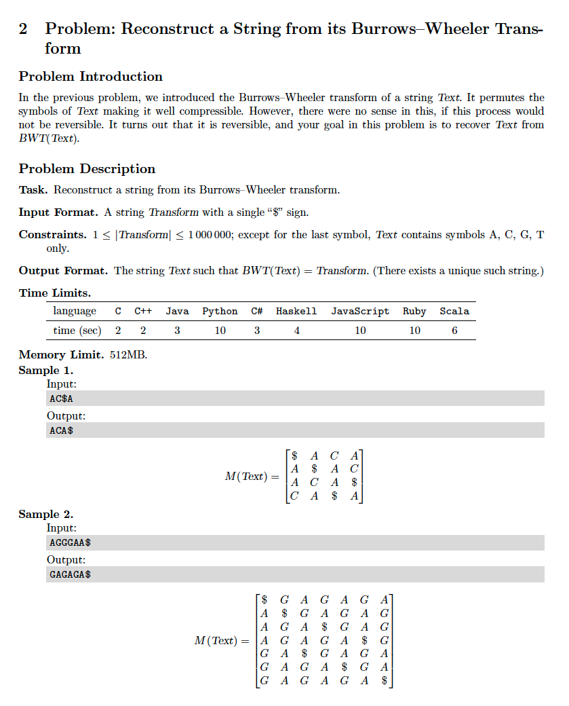

# 2. Inverse Burrows-Wheeler Transform
* [https://en.wikipedia.org/wiki/Burrows%E2%80%93Wheeler_transform](https://en.wikipedia.org/wiki/Burrows%E2%80%93Wheeler_transform)

## Problem


## Solutions
* [C++](#cpp)

### CPP
```cpp
    #include <iostream>
    #include <sstream>
    #include <string>
    #include <algorithm>
    #include <queue>

    using namespace std;

    int main() {
        using Strings = vector< deque< char > >;
        Strings S;
        const string str{ "AGGGAA$" };
        auto N = str.size();
        bool first{ true };
        for( auto i{ 0 }; i < N; ++i ){
            if( first )
                for( auto c: str )
                    S.push_back( deque{ c } );
            else
                for( auto j{ 0 }; j < N; ++j )
                    S[ j ].push_front( str[ j ] );
            sort( S.begin(), S.end() );
            first = false;
        }
        for( auto i{ 0 }; i < N; ++i, cout << endl )
            for( auto j{ 0 }; j < S[ i ].size(); ++j )
                cout << S[ i ][ j ];
        auto it = find_if( S.begin(), S.end(), []( const auto& s ){ return s.back() == '$'; });
        assert( it != S.end() );
        string inverse{ it->begin(), it->end() };
        assert( inverse == "GAGAGA$" );
        cout << endl << inverse << endl;
        return 0;
    }
```
