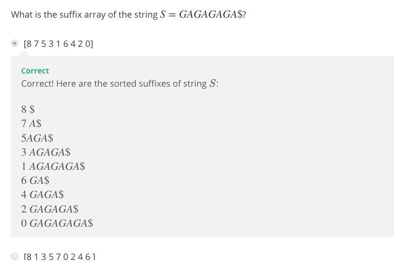
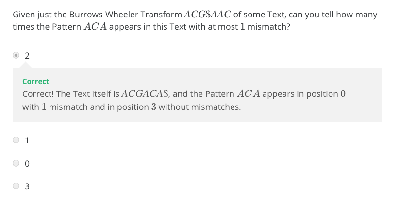
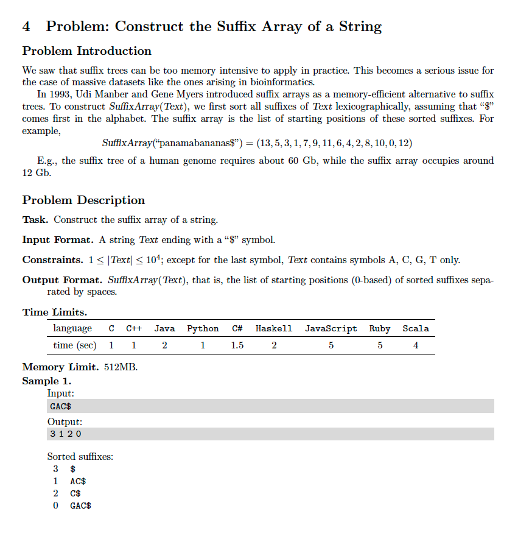
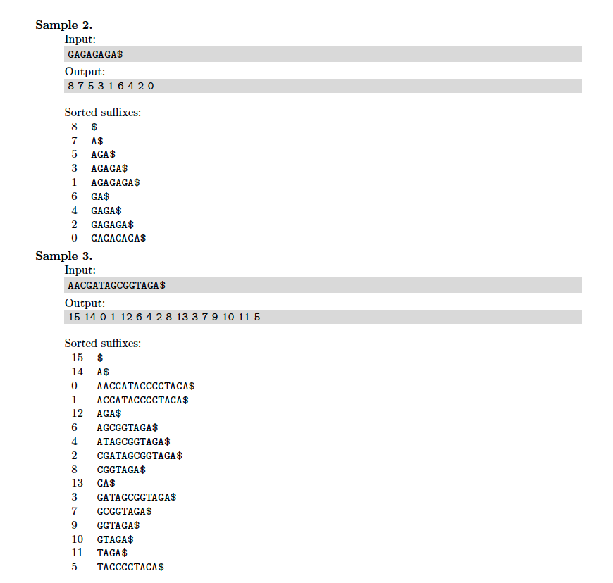

# 4. Suffix Array
* [https://en.wikipedia.org/wiki/Suffix_array](https://en.wikipedia.org/wiki/Suffix_array)

## Lecture
### Quiz


The answer for this quiz is derived from the Burrows-Wheeler Transform Maxtrix of ```GAGAGAGA$```:
```
    $GAGAGAGA
    A$GAGAGAG
    AGA$GAGAG
    AGAGA$GAG
    AGAGAGA$G
    GA$GAGAGA
    GAGA$GAGA
    GAGAGA$GA
    GAGAGAGA$
```



The answer for this quiz is derived from the Burrows-Wheeler Transform Maxtrix of ```ACGACA$```:
```
    Burrows-Wheeler Transform: ACG$AAC
    Original Genome:           ACGACA$
    
Pattern: ACA  ->  A"CA"  ->  A->C

    suffix  BWT      mismatch  first-
    array   matrix   count     last
    index
    6       $ACGACA 
    5       A$ACGAC  0         A1->C1
    3       ACA$ACG  1         A2->G1
    0       ACGACA$  1         A3->$1
    4       CA$ACGA
    1       CGACA$A
    2       GACA$AC

Pattern: AC  ->  "AC"  ->  C->A

    suffix  BWT      mismatch  first-
    array   matrix   count     last
    index
    6       $ACGACA  1         $1->A1
    5       A$ACGAC  
    3       ACA$ACG  
    0       ACGACA$  
    4       CA$ACGA  0         C1->A2
    1       CGACA$A  
    2       GACA$AC  2         N/A (more than 1 mismatch)

Pattern: C  ->  "A"  ->  A

    suffix  BWT      mismatch  first
    array   matrix   count     
    index
    6       $ACGACA
    5       A$ACGAC  1         A1      
    3       ACA$ACG  0         A2
    0       ACGACA$  
    4       CA$ACGA  
    1       CGACA$A  
    2       GACA$AC

Where is A1 and A2 in the original genome?

A1 exists at index 0 with 1 mismatch
A2 exists at index 3 with 0 mismatches

```

### FAQ
* [http://bioinformaticsalgorithms.com/faqs/bwt.html](http://bioinformaticsalgorithms.com/faqs/bwt.html)

### Pseudocode for Pattern Matching with Suffix Array


## Problem



## Solutions
* [C++](#cpp)

### CPP
```cpp
    #include <iostream>
    #include <sstream>
    #include <string>
    #include <vector>
    #include <algorithm>
    #include <iterator>
    
    //#define OUTPUT_CYCLIC_ROTATIONS__THE_BURROWS_WHEELER_TRANSFORM_MATRIX
    //#define OUTPUT_BURROWS_WHEELER_TRANSFORM
    #define OUTPUT_SUFFIX_ARRAY_INDEXES
    
    using namespace std;
    using Strings = vector< string >;
    using Indexes = vector< size_t >;
    int main() {
        Strings S;
        string text; cin >> text;
        const auto N = text.size();
        for( auto i{ 0 }; i < N; ++i ){
            rotate( text.begin(), text.begin()+1, text.end() );
            S.push_back( text );
        }
        sort( S.begin(), S.end() );
    #ifdef OUTPUT_CYCLIC_ROTATIONS__THE_BURROWS_WHEELER_TRANSFORM_MATRIX
        copy( S.begin(), S.end(), ostream_iterator< string >( cout, "\n" ) );
    #endif
    #ifdef OUTPUT_BURROWS_WHEELER_TRANSFORM
        Strings T( N );
        transform( S.begin(), S.end(), T.begin(), []( const auto& str ){ return str.back(); });
        ostringstream os; copy( T.begin(), T.end(), ostream_iterator< string >( os, "" ) );
        cout << endl << os.str() << endl;
    #endif
    #ifdef OUTPUT_SUFFIX_ARRAY_INDEXES
        Indexes I( N );
        transform( S.begin(), S.end(), I.begin(),
            []( const auto& line ){ return line.size() - line.find( '$' ) - 1; }); // -1 for 0-based indexing
        copy( I.begin(), I.end(), ostream_iterator< int >( cout, " " ) );
    #endif
        return 0;
    }
```
