# 4. Suffix Array
* [https://en.wikipedia.org/wiki/Suffix_array](https://en.wikipedia.org/wiki/Suffix_array)

## Contents
* [Memory Efficient Data Structure](#memory-efficient-data-structure)
* [General Strategy for Construction](#general-strategy-for-construction)
* [Initialization](#initialization)
* [Sort Doubled Cyclic Shifts](#sort-doubled-cyclic-shifts)

## Lecture
### Memory Efficient Data Structure


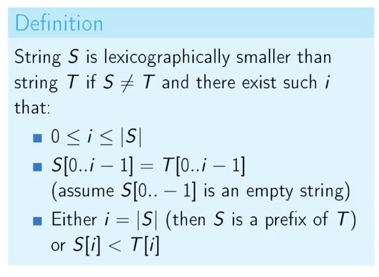


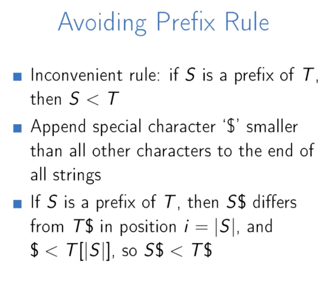


#### Memory Storage Problem
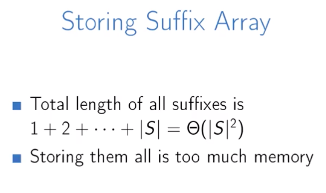

#### Quiz


#### Memory Storage Solution


#### Suffix Array Order
Use the [Burrows-Wheeler Transform Matrix](../2_week_suffix_arrays/1_burrows_wheeler_transform)
(i.e. the sorted Cyclic Rotations) to find and order all suffixes of the original string ```ababaa$```:

```
$ababaa
a$ababa
aa$abab
abaa$ab
ababaa$
baa$aba
babaa$a
```

Remove all characters after the ```$``` delimiter and only the ordered suffixes remain:

```
$
a$
aa$
abaa$
ababaa$
baa$
babaa$
```

The **Suffix Array Order** is the begin index of each of the ordered suffixes in the original string:


```

ababaa$
01234567

order   suffix
-----   ------
        $
        a$
        aa$
        abaa$
        ababaa$
        baa$
        babaa$
```


```
      v
ababaa$
01234567
      ^

order   suffix
-----   ------
    6   $
        a$
        aa$
        abaa$
        ababaa$
        baa$
        babaa$
```


```
     vv
ababaa$
01234567
     ^^ 

order   suffix
-----   ------
    6   $
    5   a$
        aa$
        abaa$
        ababaa$
        baa$
        babaa$
```

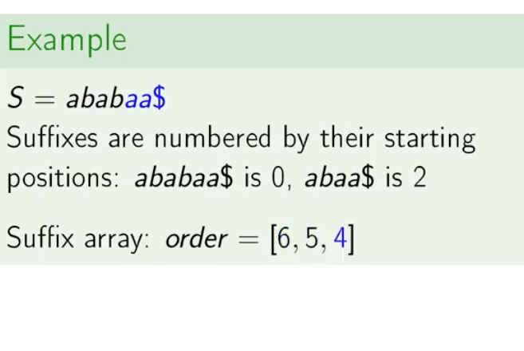

```
    vvv
ababaa$
01234567
    ^^^

order   suffix
-----   ------
    6   $
    5   a$
    4   aa$
        abaa$
        ababaa$
        baa$
        babaa$
```


```
  vvvvv
ababaa$
01234567
  ^^^^^    

order   suffix
-----   ------
    6   $
    5   a$
    4   aa$
    2   abaa$
        ababaa$
        baa$
        babaa$
```

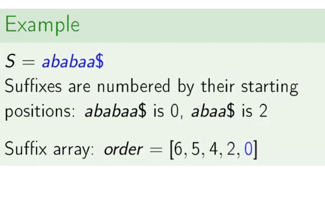

```
vvvvvvv
ababaa$
01234567
^^^^^^^    

order   suffix
-----   ------
    6   $
    5   a$
    4   aa$
    2   abaa$
    0   ababaa$
        baa$
        babaa$
```

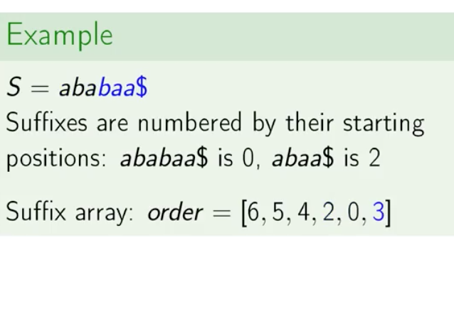

```
   vvvv
ababaa$
01234567
   ^^^^    

order   suffix
-----   ------
    6   $
    5   a$
    4   aa$
    2   abaa$
    0   ababaa$
    3   baa$
        babaa$
```


```
 vvvvvv
ababaa$
01234567
 ^^^^^^    

order   suffix
-----   ------
    6   $
    5   a$
    4   aa$
    2   abaa$
    0   ababaa$
    3   baa$
    1   babaa$
```


### General Strategy for Construction
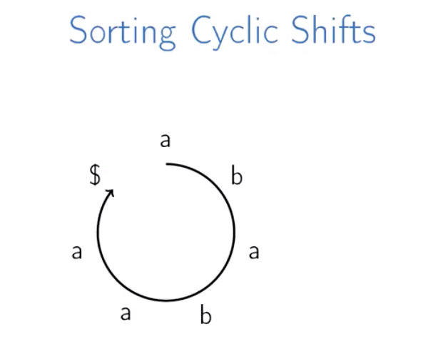
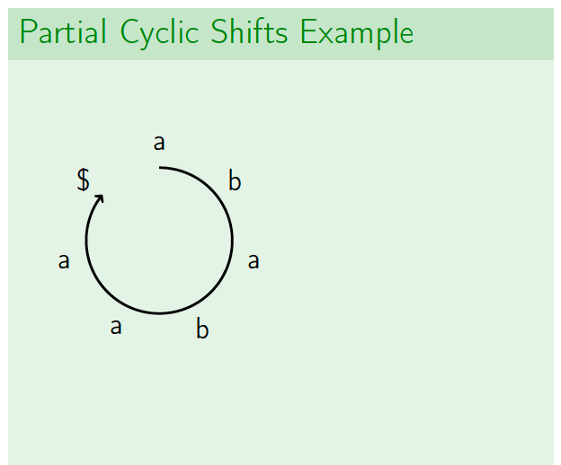


#### Quiz
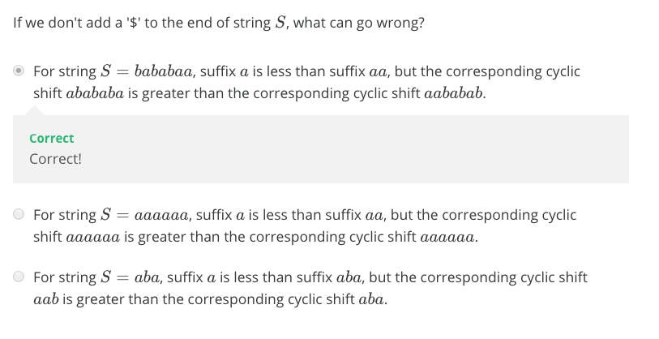

#### Partial Cyclic Shifts
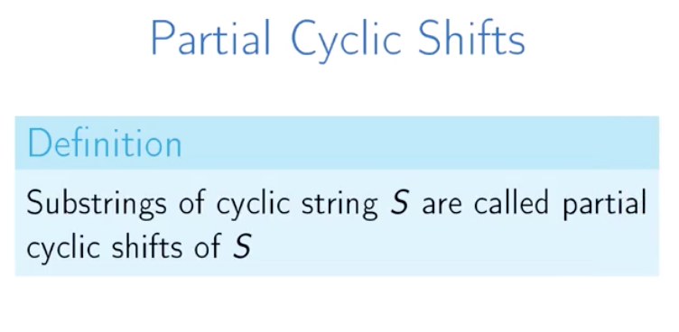

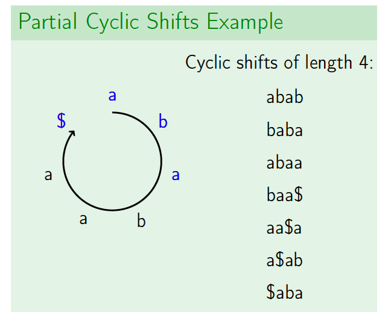

#### Partial Cyclic Shift Strategy


#### Partial Cyclic Shift Example
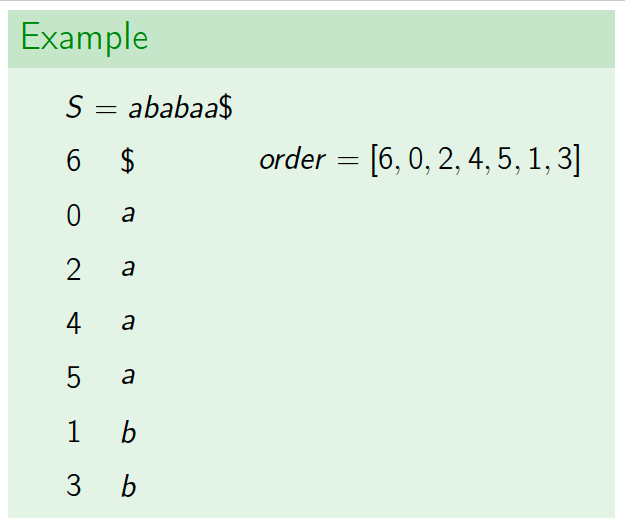


### Initialization
#### Counting Sort
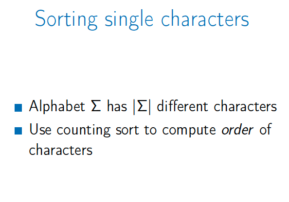

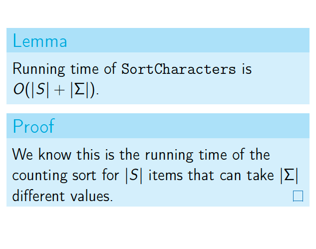

#### Equivalence Classes
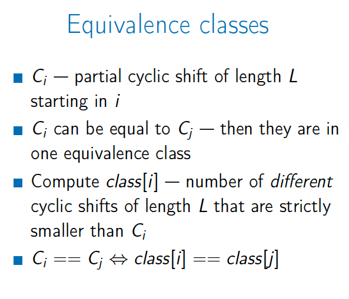
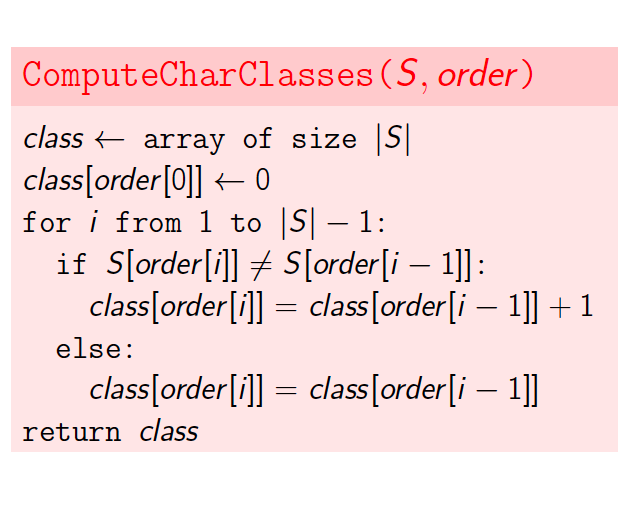


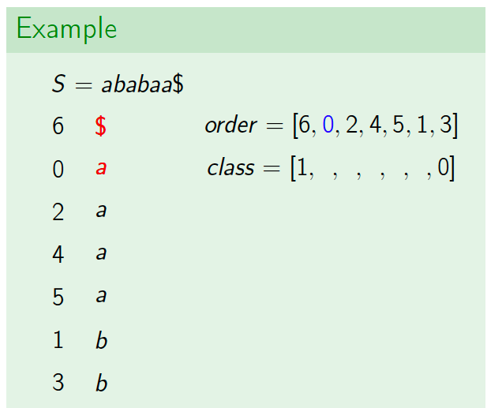


### Sort Doubled Cyclic Shifts


### FAQ
* [http://bioinformaticsalgorithms.com/faqs/bwt.html](http://bioinformaticsalgorithms.com/faqs/bwt.html)


## Problem

## Solutions
* [C++](#cpp)

### CPP
```cpp

```
