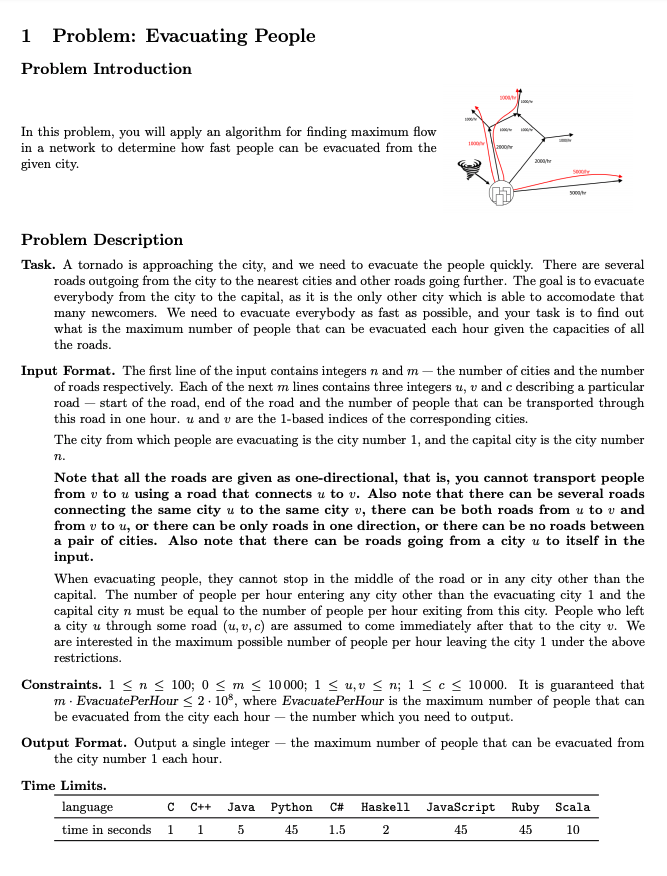
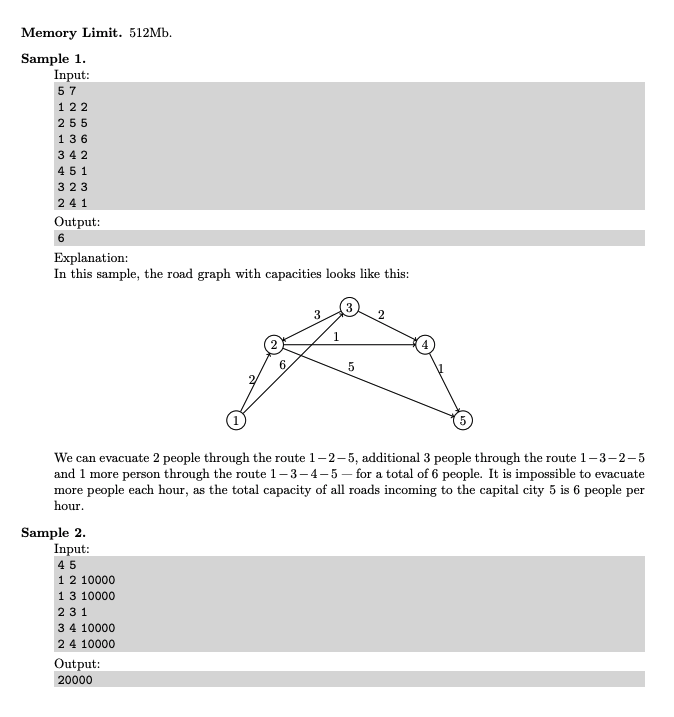
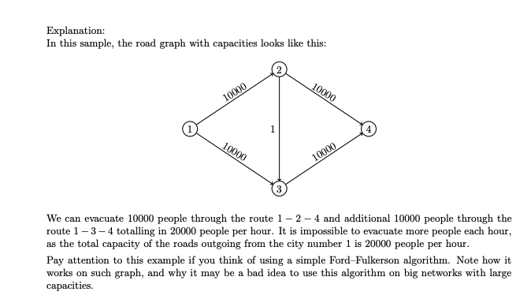
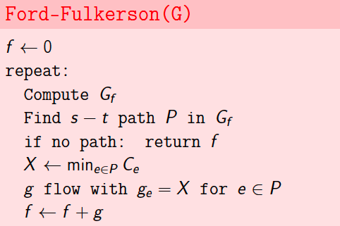

# 1. Evacuating People
* [Maximum-Flow Problem](https://en.wikipedia.org/wiki/Maximum_flow_problem)
* [Ford-Fulkerson Algorithm](https://en.wikipedia.org/wiki/Ford-Fulkerson_algorithm)
* [Edmonds-Karp Algorithm](https://en.wikipedia.org/wiki/Edmonds-Karp_algorithm)
* [Augmenting Paths](https://en.wikipedia.org/wiki/Flow_network#Augmenting_paths)

## Lecture Slides
* [Introduction](../docs/1_lecture1_transporting_goods.pdf)
* [Network Flows](../docs/1_lecture2_network_flows.pdf)
* [Residual Networks](../docs/1_lecture3_residual_networks.pdf)
* [Maxflow-Mincut](../docs/1_lecture4_maxflow_mincut.pdf)
* [Ford-Fulkerson](../docs/1_lecture5_ford_fulkerson.pdf)
* [Example](../docs/1_lecture6_example.pdf)
* [Edmonds-Karp](../docs/1_lecture7_edmonds_karp.pdf)
* [Bipartite Matching](../docs/1_lecture8_bipartite_matching.pdf)
* [Image Segmentation](../docs/1_lecture9_image_segmentation.pdf)

## Problem




## Pseudocode


## Solutions
* [C++](#cpp)

### CPP
```cpp
    #include <iostream>
    #include <vector>
    #include <queue>
    #include <unordered_set>
    
    using namespace std;
    using VI = vector< int >;
    using VVI = vector< VI >;
    using Edge = VI;
    using Graph = VVI;
    using Parent = VI;
    using Queue = queue< int >;
    using Seen = unordered_set< int >;
    auto constexpr INF = static_cast< int >( 1e5 + 1 );
    
    int main() {
        int N, M; cin >> N >> M; // N = |V| and M = |E|
        const auto S{ 1 }, T{ N }; // source S and sink T
        Graph G( N+1, VI( N+1, 0 ) ); // N+1 for 1-based indexing, initialize each edge weight to 0
        for( auto i{ 0 }; i < M; ++i ){
            int u, v, w; cin >> u >> v >> w; // u -> v edge and (w)eighted capacity of the u -> v edge
            G[u][v] += w;
        }
        auto max_flow{ 0 };
        for( ;; ){
            Queue q{{ S }}; // BFS from S -> T
            Seen seen{ S };
            Parent P( N+1, 0 ); // N+1 for 1-based indexing
            while( ! q.empty() ){
                auto u = q.front(); q.pop();
                for( auto v{ S+1 }; v <= T; ++v ){
                    if( G[u][v] == 0 || ! seen.insert( v ).second ) //  if there exists a u -> v edge with capacity > 0, then visit v once
                        continue;
                    P[ v ] = u;
                    q.push( v );
                }
            }
            if( seen.find( T ) == seen.end() ) // no augmented path found from S -> T
                break;
            auto flow{ INF };
            for( auto v{ T }; v != S; ){ // find bottleneck S -> T: ie. the minimum edge capacity along the path
                auto u = P[v];
                if( flow > G[u][v] )
                    flow = G[u][v];
                v = u;
            }
            max_flow += flow;
            for( auto v{ T }; v != S; ){ // update residual capacities of the edges and reverse edges along the path
                auto u = P[v];
                G[u][v] -= flow;
                G[v][u] += flow;
                v = u;
            }
        }
        cout << max_flow << endl;
        return 0;
    }
```
