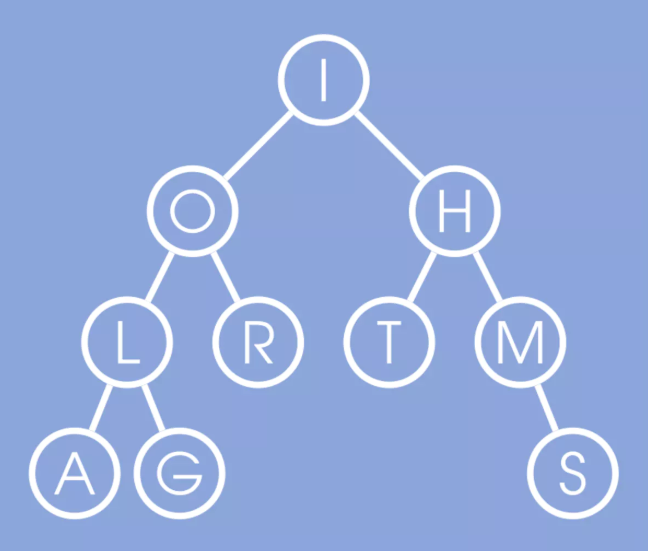

# Algorithms-UCSanDiego

## Course 1: Algorithmic Toolbox
* Week 1: Programming Challenges
  * [Sum of Two Digits](https://github.com/claytonjwong/Algorithms-UCSD/tree/master/course1/1_sum_of_two_digits)
  * [Maximum Pairwise Product](https://github.com/claytonjwong/Algorithms-UCSD/tree/master/course1/2_max_pairwise_product)
  
## Supplemental Resources
  * [Algorithms: Dasgupta-Papadimitriou-Vazirani ( 2006 )]( https://github.com/claytonjwong/Algorithms-UCSanDiego/blob/master/docs/Dasgupta-Papadimitriou-Vazirani.pdf )
  * [Algorithms and Data Structures: Mehlhorn-Sanders ( 2007 )]( https://github.com/claytonjwong/Algorithms-UCSanDiego/blob/master/docs/Mehlhorn-Sanders-Toolbox.pdf )
  * Introduction to Algorithms: Cormen-Leiserson-Rivest-Stein ( 2009 )
  * [Discrete Probability]( https://en.wikibooks.org/wiki/High_School_Mathematics_Extensions/Discrete_Probability )
  * [Mathematical Proofs]( https://en.wikibooks.org/wiki/High_School_Mathematics_Extensions/Mathematical_Proofs )
  