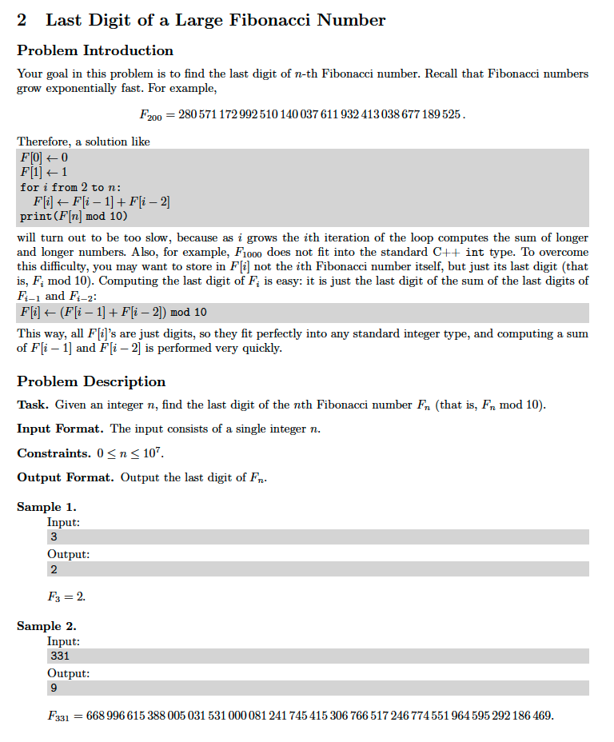

# 2. Last Digit of a Large Fibonacci Number
https://en.wikipedia.org/wiki/Fibonacci_number

## Problem


## Solutions
* [C](#c)
* [C++](#cpp)
* [Java](#java)
* [Python3](#python3)

### C
```c
    #include <stdio.h>
    #include <stdlib.h>
    #include <limits.h>

    typedef int Type;
    const Type INF = INT_MAX;

    Type fibonacci( Type N ){
        if( N < 2 )
            return N;
        Type dp[ N+1 ];
        dp[ 0 ] = 0;
        dp[ 1 ] = 1;
        for( int i = 2; i <= N; ++i )
            dp[ i ] = ( dp[ i-2 ] + dp[ i-1 ] ) % 10;
        return dp[ N ];
    }

    int main(){
        Type N = 0;
        scanf( "%d", &N );
        Type ans = fibonacci( N );
        printf( "%d\n", ans );
        return 0;
    }
```

### CPP
```cpp
    #include <iostream>
    #include <vector>

    using namespace std;

    template< typename Type >
    class Solution {
    public:

        using VT = vector< Type >;

        Type fibonacci( Type N ){
            if( N < 2 )
                return N;
            VT dp( N+1 );
            dp[ 0 ] = 0;
            dp[ 1 ] = 1;
            for( auto i{ 2 }; i <= N; ++i )
                dp[ i ] = ( dp[ i-2 ] + dp[ i-1 ] ) % 10;
            return dp[ N ];
        }
    };

    int main(){
        using Type = int;
        Solution< Type > solution;
        Type N{ 0 };
        cin >> N;
        auto ans = solution.fibonacci( N );
        cout << ans;
        return 0;
    }
```

### Java
```java
    import java.util.ArrayList;
    import java.util.Scanner;
    import java.util.Collections;

    public class Main {

        public static Integer INF = Integer.MAX_VALUE;

        public static Integer fibonacci( Integer N ){
            if( N < 2 )
                return N;
            ArrayList< Integer > dp = new ArrayList< Integer >( Collections.nCopies( N+1, INF ));
            dp.set( 0, 0 );
            dp.set( 1, 1 );
            for( int i = 2; i <= N; ++i )
                dp.set( i, (dp.get( i-2 ) + dp.get( i-1 )) % 10 );
            return dp.get( N );
        }

        public static void main( String[] args ){
            Scanner input = new Scanner( System.in );
            Integer N = input.nextInt(),
                    ans = fibonacci( N );
            System.out.println( ans );
        }
    }
```

### Python3
```python
    INF = 999999999

    def fibonacci( N ):
        if N < 2:
            return N
        dp = ( N+1 ) * [ INF ]
        dp[ 0 ] = 0
        dp[ 1 ] = 1
        for i in range( 2, N+1 ):
            dp[ i ] = ( dp[ i-2 ] + dp[ i-1 ] ) % 10
        return dp[ N ]

    if __name__ == "__main__":
        N = int( input() )
        ans = fibonacci( N )
        print( ans )
```
