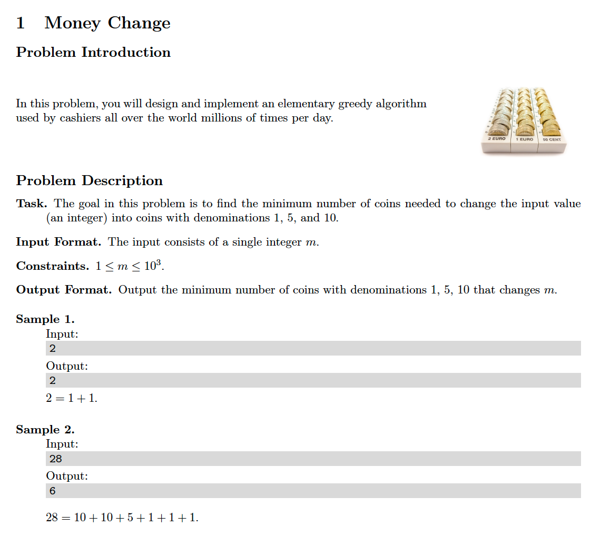

# 1. Money Change
[https://en.wikipedia.org/wiki/Greedy_algorithm](https://en.wikipedia.org/wiki/Greedy_algorithm)

## Problem


## Solutions
* [C](#c)
* [C++](#cpp)
* [Java](#java)
* [Python3](#python3)

### C
```c
    #include <stdio.h>

    typedef int Type;

    Type coin_change( Type N ){
        Type ans = 0;
        for( int C[ 3 ]={ 10, 5, 1 }, i=0; i < 3; ++i )
            for(; N >= C[ i ]; N -= C[ i ], ++ans );
        return ans;
    }

    int main(){
        Type N = 0;
        scanf( "%d", &N );
        Type ans = coin_change( N );
        printf( "%d\n", ans );
        return 0;
    }
```

### CPP
```cpp
    #include <iostream>
    #include <vector>

    using namespace std;

    template< typename Type >
    class Solution {
    public:
        using VI = vector< Type >;
        Type coin_change( Type N, VI C=VI{ 10, 5, 1 }, Type ans=0 ){
            for( auto coin: C )
                for(; N >= coin; N -= coin, ++ans );
            return ans;
        }
    };

    int main() {
        using Type = int;
        Solution< Type > solution;
        Type N{ 0 };
        cin >> N;
        auto ans = solution.coin_change( N );
        cout << ans << endl;
        return 0;
    }
```

### Java
```java
    import java.util.Scanner;

    public class Main {

        private static int coin_change( int N ){
            int ans = 0;
            int[] C = { 10, 5, 1 };
            for( int i=0; i < 3; ++i )
                for(; N >= C[ i ]; N -= C[ i ], ++ans );
            return ans;
        }

        public static void main( String[] args ){
            Scanner input = new Scanner( System.in );
            int N = input.nextInt(),
                ans = coin_change( N );
            System.out.println( ans );
        }
    }
```

### Python3
```python
    class Solution:
        def coin_change( self, N: int ) -> int:
            ans = 0
            for coin in [ 10, 5, 1 ]:
                while N >= coin:
                    N -= coin
                    ans += 1
            return ans

    if __name__ == '__main__':
        solution = Solution()
        N = int( input() )
        ans = solution.coin_change( N )
        print( ans )
```
