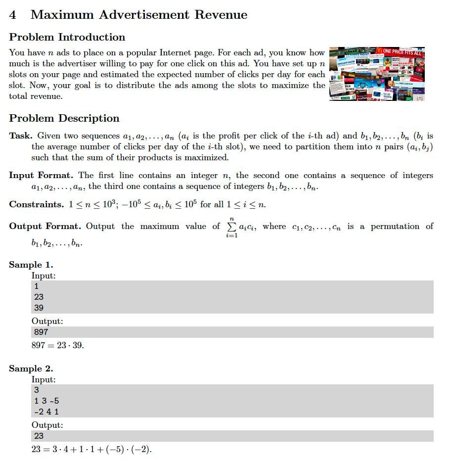

# 4. Maximum Advertisement Revenue
[https://en.wikipedia.org/wiki/Greedy_algorithm](https://en.wikipedia.org/wiki/Greedy_algorithm)

## Problem


## Solutions
* [C](#c)
* [C++](#cpp)
* [Java](#java)
* [Python3](#python3)

### C
```c
    #include <stdio.h>
    #include <stdlib.h>

    typedef long long Type;
    typedef Type* HType;

    int comparator( const void* lhs, const void* rhs ){
        Type first  = *( HType ) lhs,
             second = *( HType ) rhs;
        return( first < second )? -1
            : ( first > second )?  1
            : ( 0 );
    }

    Type maxAdRev( HType A, HType B, Type N ){
        Type ans = 0;
        qsort( A, N, sizeof( Type ), comparator );
        qsort( B, N, sizeof( Type ), comparator );
        for( int i=0; i < N; ++i )
            ans += A[ i ] * B[ i ];
        return ans;
    }

    int main() {
        Type N = 0;
        scanf( "%lld", &N );
        Type A[ N ],
             B[ N ];
        for( Type i=0; i < N; scanf( "%lld", &A[ i++ ] ));
        for( Type i=0; i < N; scanf( "%lld", &B[ i++ ] ));
        Type ans = maxAdRev( A, B, N );
        printf( "%lld\n", ans );
        return 0;
    }
```

### CPP
```cpp
    #include <iostream>
    #include <vector>
    #include <algorithm>

    using namespace std;

    template< typename Type >
    class Solution {
    public:
        using Collection = vector< Type >;
        Type maxAdRev( Collection& A, Collection& B, Type ans=0 ){
            auto N = A.size();
            sort( A.begin(), A.end() );
            sort( B.begin(), B.end() );
            for( auto i{ 0 }; i < N; ++i )
                ans += A[ i ] * B[ i ];
            return ans;
        }
    };

    int main() {
        using Type = long long;
        Solution< Type > solution;
        Type N{ 0 }; cin >> N;
        Solution< Type >::Collection A( N ), B( N );
        for( Type i{ 0 }; i < N; cin >> A[ i++ ] );
        for( Type i{ 0 }; i < N; cin >> B[ i++ ] );
        auto ans = solution.maxAdRev( A, B );
        cout << ans << endl;
        return 0;
    }
```

### Java
```java
import java.util.Scanner;
import java.util.Arrays;

public class Main {

    public static long maxAdRev( long[] A, long[] B, int N ){
        Arrays.sort( A );
        Arrays.sort( B );
        long ans = 0;
        for( int i=0; i < N; ++i )
            ans += A[ i ] * B[ i ];
        return ans;
    }

    public static void main( String[] args ){
        Scanner input = new Scanner( System.in );
        int N = input.nextInt();
        long A[] = new long[ N ];
        long B[] = new long[ N ];
        for( int i=0; i < N; A[ i++ ]=input.nextLong() );
        for( int i=0; i < N; B[ i++ ]=input.nextLong() );
        long ans = maxAdRev( A, B, N );
        System.out.println( ans );
    }
}
```

### Python3
```python
from typing import List

class Solution:
    def maxAdRev( self, A: List[int], B: List[int], N: int ) -> int:
        A.sort()
        B.sort()
        ans = 0
        for i in range( 0, N ):
            ans += A[ i ] * B[ i ]
        return ans

if __name__ == '__main__':
    solution = Solution()
    N = int( input() )
    A = list( map( int, input().split() ))
    B = list( map( int, input().split() ))
    ans = solution.maxAdRev( A, B, N )
    print( ans )
```
