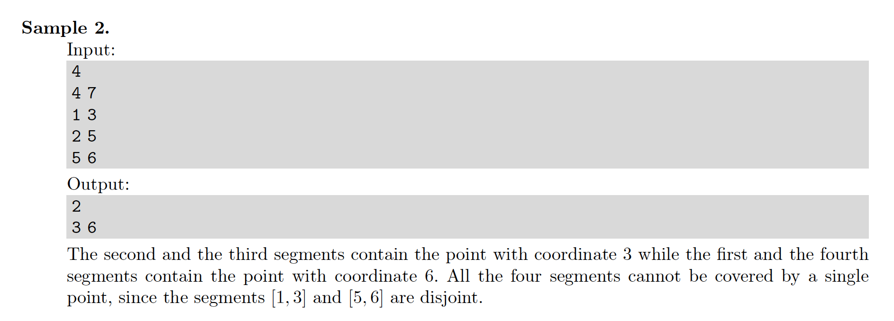

# 5. Collecting Signatures
[https://en.wikipedia.org/wiki/Greedy_algorithm](https://en.wikipedia.org/wiki/Greedy_algorithm)

## Problem



## Solutions
* [C](#c)
* [C++](#cpp)
* [Java](#java)
* [Python3](#python3)

### C
```c
    #include <stdio.h>
    #include <stdlib.h>

    typedef int Type;
    typedef Type* HType;

    typedef struct {
        Type a, b;
    } Segment;
    Segment createSegment( Type a, Type b ){
        Segment S;
        S.a = a;
        S.b = b;
        return S;
    }
    typedef Segment* HSegment;

    int comparator( const void* lhs, const void* rhs ){ // descending order of segment end-point b
        Segment first  = *( HSegment ) lhs,
                second = *( HSegment ) rhs;
        if( first.b == second.b )
            return( first.a < second.a )? 1 : -1;
        return( first.b < second.b )? 1 : -1;
    }

    void minPoints( HSegment cur, Type N, HType ans ){
        size_t w = 0; // (w)rite index into (ans)wer
        for( size_t i=0; i < N; ++i )
            ans[ i ] = 0;
        qsort( cur, N, sizeof( Segment ), comparator );
        for( Segment next[ N ]; 0 < N; ){
            Type B = cur[ N-1 ].b; // greedy choice: the smallest segment end-point b
            ans[ w++ ] = B;
            size_t x = 0; // write index into ne(x)t
            for( size_t i=0; i < N; ++i ) if( ! ( cur[ i ].a <= B && B <= cur[ i ].b )) // next is all (s)egments of cur which do NOT contain B
                next[ x++ ] = cur[ i ];
            N = x;
            for( int i=0; i< N; ++i )
                cur[ i ] = next[ i ];
        }
    }

    int main() {
        Type N = 0; scanf( "%d", &N );
        Segment S[ N ];
        for( Type i=0, a=0, b=0; i < N; ++i ){
            scanf( "%d %d", &a, &b );
            S[ i ] = createSegment( a, b );
        }
        Type ans[ N ];
        minPoints( S, N, ans );
        int x = 0;
        for(; 0 < ans[ x ]; ++x );
        printf( "%d\n", x );
        for( size_t i=0; i < x; ++i )
            printf( "%d ", ans[ i ] );
        printf( "\n" );
        return 0;
    }
```

### CPP
```cpp
    #include <iostream>
    #include <iomanip>
    #include <vector>
    #include <algorithm>
    #include <iterator>

    using namespace std;

    using Type = int;
    struct Segment {
        Type a{ 0 }, b{ 0 };
        bool operator<( const Segment& rhs ) const {
            return ! ( b < rhs.b ); // descending order of segment end-point b
        }
    };
    ostream& operator<<( ostream& stream, const Segment& rhs ){
        stream << "{ " << rhs.a << "," << rhs.b << " }";
        return stream;
    }
    using Segments = vector< Segment >;

    class Solution {
    public:
        using Collection = vector< Type >;
        Collection minPoints( Segments& cur, Collection ans={} ){
            sort( cur.begin(), cur.end() );
            int trim = 0;
            for( Segments next; ! cur.empty(); swap( cur,next ), next.clear(), ++trim ){
                auto B = cur.back().b; // greedy choice: the smallest segment end-point b
                ans.emplace_back( B );
                cur.pop_back();
                for( auto s: cur ) if( ! ( s.a <= B && B <= s.b )) // next is all (s)egments of cur which do NOT contain B
                    next.emplace_back( s );
            }
            return ans;
        }
    };

    int main() {
        Type N{ 0 }; cin >> N;
        Segments S( N );
        for( int i{ 0 }; i < N; ++i ){
            Type a{ 0 }, b{ 0 }; cin >> a >> b;
            S[ i ] = { a,b };
        }
        Solution solution;
        auto ans = solution.minPoints( S );
        cout << ans.size() << endl;
        copy( ans.begin(), ans.end(), ostream_iterator< Type >( cout, " " ));
        cout << endl;
        return 0;
    }
```

### Java
```java

```

### Python3
```python

```
