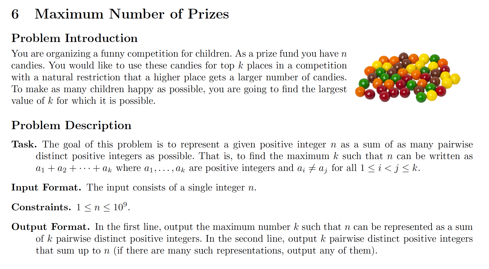

# 6. Maximum Number of Prizes
[https://en.wikipedia.org/wiki/Greedy_algorithm](https://en.wikipedia.org/wiki/Greedy_algorithm)

## Problem



## Solutions
* [C](#c)
* [C++](#cpp)
* [Java](#java)
* [Python3](#python3)

### C
```c
    #include <stdio.h>
    #include <stdlib.h>

    typedef int Type;
    const Type INF = 1e9 + 1;

    struct List_t {
        Type val;
        struct List_t* next;
    };
    typedef struct List_t List;
    typedef List* HList;
    HList createNode( Type val ) {
        HList node = malloc( sizeof( List ));
        node->val = val;
        node->next = NULL;
        return node;
    }
    HList appendNode( HList tail, Type val ){
        tail->next = malloc( sizeof( List ));
        tail = tail->next;
        tail->val = val;
        tail->next = NULL;
        return tail;
    }

    HList maxNumPrizes( Type N ){
        HList head = createNode( INF ),
              tail = head;
        size_t size = 0;
        for( Type i=1; i+1 <= N-i; N-=i, ++i, ++size )
            tail = appendNode( tail, i );
        if( 0 < N )
            tail = appendNode( tail, N ), ++size;
        printf( "%zu\n", size );
        return head;
    }

    int main() {
        Type N = 0, size = 0;
        scanf( "%d", &N );
        for( HList ans=maxNumPrizes( N )->next; ans; ans=ans->next ) // head is a sentinel, the (ans)wer is head->next
            printf( "%d ", ans->val );
        printf( "\n" );
        return 0;
    }
```

### CPP
```cpp
    #include <iostream>
    #include <vector>
    #include <iterator>

    using namespace std;

    template< typename Type >
    class Solution {
    public:
        using Collection = vector< Type >;
        Collection maxNumPrizes( Type N,Collection ans={} ){
            for( Type i{ 1 }; i+1 <= N-i; N-=i, ++i )
                ans.push_back( i );
            if( 0 < N )
                ans.push_back( N );
            return ans;
        }
    };

    int main() {
        using Type = int;
        Solution< Type > solution;
        Type N{ 0 }; cin >> N;
        auto ans = solution.maxNumPrizes( N );
        cout << ans.size() << endl;
        copy( ans.begin(), ans.end(), ostream_iterator< Type >( cout, " " ));
        cout << endl;
        return 0;
    }
```

### Java
```java
    import java.util.Scanner;
    import java.util.ArrayList;

    public class Main {

        public static ArrayList maxNumPrizes( int N ){
            ArrayList ans = new ArrayList();
            for( int i=1; i+1 <= N-i; N-=i, ++i )
                ans.add( i );
            if( 0 < N )
                ans.add( N );
            return ans;
        }

        public static void main( String[] args ){
            Scanner input = new Scanner( System.in );
            int N = input.nextInt();
            ArrayList ans = maxNumPrizes( N );
            System.out.println( ans.size() );
            ans.forEach(( i ) -> System.out.print( i + " " ));
        }
    }
```

### Python3
```python
    from typing import List

    class Solution:
        def maxNumPrizes( self, N: int ) -> List[int] :
            ans = []
            i = 1
            while i+1 <= N-i:
                ans.append( i )
                N -= i
                i += 1
            if 0 < N:
                ans.append( N )
            return ans

    if __name__ == '__main__':
        solution = Solution()
        N = int( input() )
        ans = solution.maxNumPrizes( N )
        print( len( ans ))
        for x in ans:
            print( x, end=" " )
```
