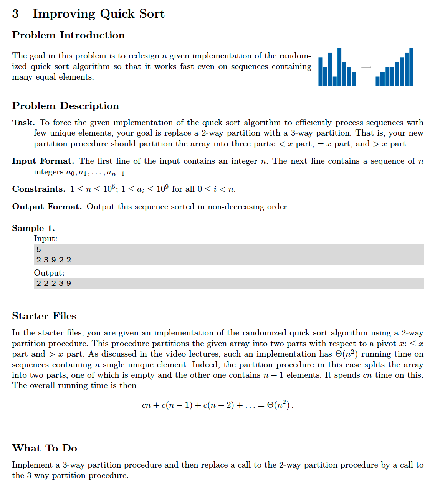

# 3. Improving Quicksort
[https://en.wikipedia.org/wiki/Quicksort](https://en.wikipedia.org/wiki/Quicksort)

## Problem


## Solutions
* [C++](#cpp)
* [Python3](#python3)

### CPP
```cpp
    #include <iostream>
    #include <vector>
    #include <random>
    #include <sstream>
    #include <algorithm>
    #include <iterator>

    using namespace std;

    template< typename Type >
    class Solution
    {
    public:
        using Collection = vector< Type >;
        using Iter = typename Collection::iterator;
        void quickSort( Collection& A ){
            go( A, A.begin(), A.end() );
        }
    private:
        void go( Collection& A, Iter L, Iter R ){   // go() sorts from [ L : R ), that is, from L (inclusive) to R (non-inclusive)
            if( L >= R )
                return;
            iter_swap( L, random( L, R ));          // set pivot as first element
            auto[ M1, M2 ] = partition3( A, L, R );
            go( A, L, M1 );
            go( A, M2, R );
        }
        Iter partition( Collection& A, Iter L, Iter R ){
            auto threshold{ L }, less{ L+1 };
            for( auto more{ less }; more != R; ++more )
                if( *more < *threshold )
                    iter_swap( less++, more );
            auto pivot{ less-1 };
            iter_swap( L, pivot );
            return pivot;
        }
        pair< Iter, Iter > partition3( Collection& A, Iter L, Iter R ){
            auto P = partition( A, L, R ),
                 M1{ P },
                 M2{ P };
            for( auto i{ R-1 }; M2 <= i; )
                if( *i == *P )
                    iter_swap( i, M2++ );
                else
                    --i;
            return{ M1, M2 };

        }
        using RandomDevice = random_device;
        using Generator = mt19937;
        using Distribution = uniform_int_distribution< int >;
        Iter random( Iter L, Iter R, RandomDevice randomDevice=RandomDevice() ){
            Generator randomGenerator{ randomDevice() };
            int size = distance( L, R-1 );        // R-1 since R is non-inclusive
            Distribution distribution{ 0, size }; // distribution from [ 0 : size ], that is 0 ( inclusive ) to size ( inclusive )
            return L + distribution( randomGenerator );
        }
    };

    int main() {
        using Type = size_t;
        Solution< Type > solution;
        Solution< Type >::Collection A;
        auto N{ 0 }; cin >> N;
        copy_n( istream_iterator< Type >( cin ), N, back_inserter( A ));
        solution.quickSort( A );
        copy( A.begin(), A.end(), ostream_iterator< Type >( cout, " " ));
        return 0;
    }
```

### Python3
```python
    import random
    from typing import List

    class Solution:
        def quickSort( self, A: List[int] ):
            self.go( A, 0, len(A) )
        def go( self, A: List[int], L: int, R: int ):
            if R - L < 2:
                return
            P = random.randint( L, R-1 ) # R is non-inclusive
            A[ L ], A[ P ] = A[ P ], A[ L ]
            M1, M2 = self.partition3( A, L, R )
            self.go( A, L, M1 )
            self.go( A, M2, R )
        def partition( self, A: List[int], L: int, R: int ):
            threshold = A[ L ]
            less = L + 1
            more = less
            while more != R:
                if A[ more ] < threshold:
                    A[ less ], A[ more ] = A[ more ], A[ less ]
                    less += 1
                more += 1
            pivot = less - 1
            A[ L ], A[ pivot ] = A[ pivot ], A[ L ]
            return pivot
        def partition3( self, A: List[int], L: int, R: int ):
            P = self.partition( A, L, R )
            M1 = P
            M2 = P
            i = R - 1
            while M2 < i:
                if A[ i ] == A[ P ]:
                    A[ M2 ], A[ i ] = A[ i ], A[ M2 ]
                    M2 += 1
                else:
                    i -= 1
            return M1, M2

    if __name__ == '__main__':
        N = input()
        A = list( map( int, input().split() ))    
        Solution().quickSort( A )
        for x in A:
            print( x, end=" " )
```
