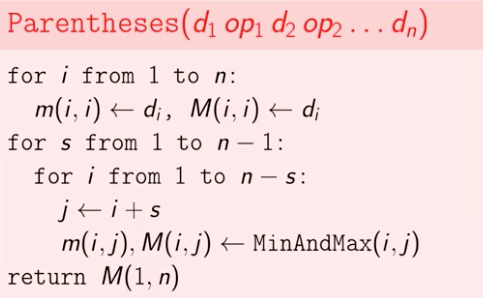
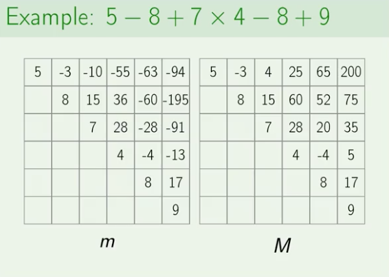

# 3. Maximum Value of an Artithmetic Expression
* [https://en.wikipedia.org/wiki/Bracket_(mathematics)](https://en.wikipedia.org/wiki/Bracket_(mathematics))

## Problem


## Pseudocode



## Example


## Solutions
* [C++](#cpp)
* [Python3](#python3)

### CPP
```cpp
    #include <iostream>
    #include <sstream>
    #include <vector>
    #include <string>
    #include <limits>

    using namespace std;

    class Solution {
    public:
        using VI = vector< int >;
        using VVI = vector< VI >;
        int maxValExp( const string& input ){
            auto[ D, op ] = read( input );
            if( D.empty() )
                return 0;
            auto N = static_cast< int >( D.size() );
            VVI m( N, VI( N ) ), M( N, VI( N ) );
            for( auto i{ 0 }; i < N; ++i )
                m[ i ][ i ] = M[ i ][ i ] = D[ i ];
            for( auto s{ 1 }; s < N; ++s ){ // (s)ize
                for( auto i{ 0 }; i < N - s; ++i ){
                    auto j{ i+s };
                    auto[ mini, maxi ] = minMax( m, M, op, i, j );
                    m[ i ][ j ] = mini;
                    M[ i ][ j ] = maxi;
                }
            }
            return M[ 0 ][ N-1 ];
        }
    private:
        using Input = pair< VI,VI >;
        Input read( const string& input, VI D={}, VI Op={} ){
            istringstream stream{ input };
            auto d{ 0 }; stream >> d; D.push_back( d );
            for( char op; stream >> op >> d; Op.push_back( op ), D.push_back( d ) );
            return{ D, Op };
        }
        using MinMax = pair< int,int >;
        MinMax minMax( const VVI& m, const VVI& M, const VI& op, int i, int j ){
            auto mini = numeric_limits< int >::max(),
                 maxi = numeric_limits< int >::min();
            for( auto k{ i }; k < j; ++k ){
                auto a = calc( M[ i ][ k ], op[ k ], M[ k+1 ][ j ] ),
                     b = calc( M[ i ][ k ], op[ k ], m[ k+1 ][ j ] ),
                     c = calc( m[ i ][ k ], op[ k ], M[ k+1 ][ j ] ),
                     d = calc( m[ i ][ k ], op[ k ], m[ k+1 ][ j ] );
                mini = min({ mini, a,b,c,d });
                maxi = max({ maxi, a,b,c,d });
            }
            return{ mini,maxi };
        }
        int calc( int first, int op, int second ){
            switch( op ){
                case '+': return first + second;
                case '-': return first - second;
                case '*': return first * second;
                case '/': return first / second;
            }
            return 0;
        }
    };

    int main() {
        Solution solution;
        string input; cin >> input;
        auto ans = solution.maxValExp( input );
        cout << ans << endl;
        return 0;
    }
```

### Python3
```python
    import re
    from typing import List, Tuple
    from collections import deque

    class Solution:
        def maxValExp( self, D: List[int], op: List[int] ) -> int:
            N = len( D )
            if N == 0:
                return 0
            m = [[ 0 for _ in range( N ) ] for _ in range( N ) ]
            M = [[ 0 for _ in range( N ) ] for _ in range( N ) ]
            for i in range( 0, N ):
                m[ i ][ i ], M[ i ][ i ] = D[ i ], D[ i ]
            for s in range( 1, N ):
                for i in range( 0, N - s ):
                    j = i + s
                    mini, maxi = self.minMax( m, M, op, i, j )
                    m[ i ][ j ] = mini
                    M[ i ][ j ] = maxi
            return M[ 0 ][ N-1 ]
        def minMax( self, m: List[int], M: List[int], op: List[int], i: int, j: int ) -> Tuple[ int, int ]:
            mini = 777
            maxi = -777
            for k in range( i, j ):
                a = self.calc( M[ i ][ k ], op[ k ], M[ k+1 ][ j ] )
                b = self.calc( M[ i ][ k ], op[ k ], m[ k+1 ][ j ] )
                c = self.calc( m[ i ][ k ], op[ k ], M[ k+1 ][ j ] )
                d = self.calc( m[ i ][ k ], op[ k ], m[ k+1 ][ j ] )
                mini = min( mini, a,b,c,d )
                maxi = max( maxi, a,b,c,d )
            return mini, maxi
        def calc( self, first: int, op: int, second: int ) -> int:
            if op == '+':
                return first + second
            elif op == '-':
                return first - second
            elif op == '*':
                return first * second
            elif op == '/':
                return first / second
            else:
                return 0

    Input = List[int], List[int]
    def readInput() -> Input:
        exp = input()
        D = list( map( int, re.split( r"[+-\/\*]+", exp ) ) )
        op = deque( re.split( r"\d+", exp ) )
        op.popleft(), op.pop() # remove junk chars from re split
        return D, list( op )
    if __name__ == '__main__':
        solution = Solution()
        D, op = readInput()
        ans = solution.maxValExp( D, op )
        print( ans )
```
